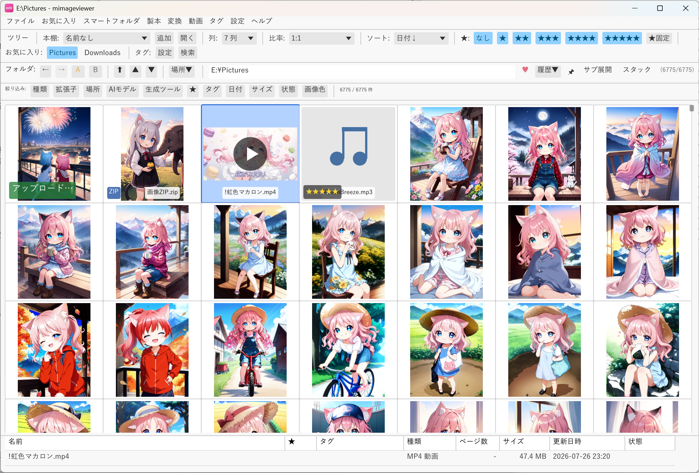
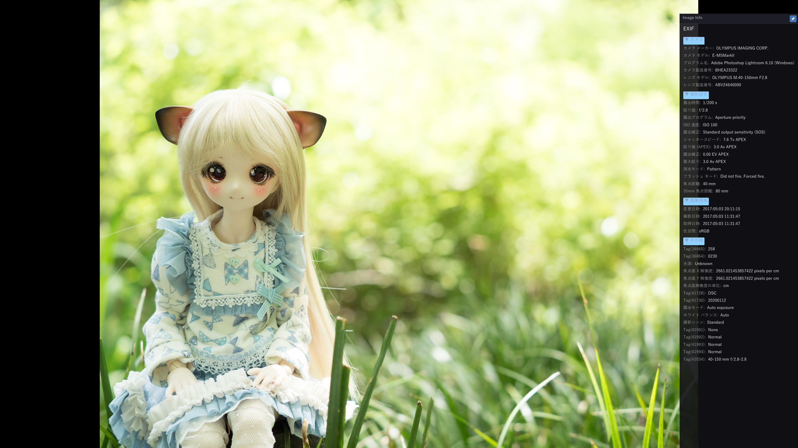
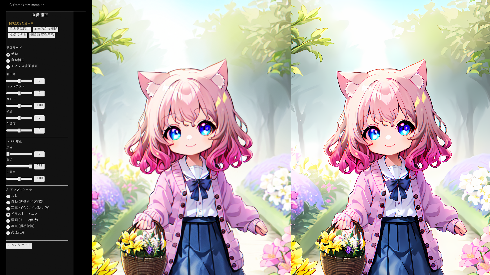
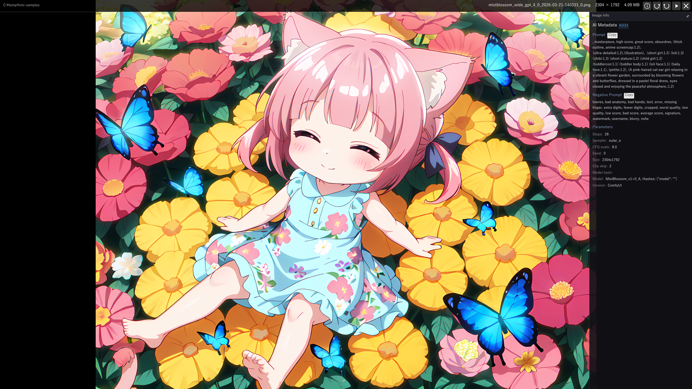

# mImageViewer

**English** | [日本語](#日本語)

A fast, GPU-accelerated **image, comic/manga and video viewer for Windows 11**, written in Rust.
It opens folders as a thumbnail grid, reads images straight out of ZIP and PDF, plays video
inline, and includes GPU AI upscaling.

> **Note:** The application UI is currently available in **Japanese only**.

### Highlights

- GPU-accelerated thumbnail grid with an on-disk cache (instant on re-open)
- Wide format support: JPEG, PNG, GIF, WebP, BMP, HEIC/HEIF, AVIF, JPEG XL, TIFF and camera RAW
- Reads images directly inside **ZIP / CBZ** archives and **PDF** — no extraction.
  Non-solid **RAR / CBR** open directly too; solid / nested / password-protected RAR, plus 7z / CB7 and LZH, are auto-converted to ZIP on click
- **Two-page spread** reading (left-to-right / right-to-left) and continuous vertical /
  horizontal scrolling for manga & comics
- **Inline video playback** (MP4 / MKV / MOV / AVI / WMV / MPEG / HEVC / AV1) via FFmpeg
- **AI 4x upscaling** (Real-ESRGAN / Real-CUGAN / NMKD-Siax), JPEG denoise and an MI-GAN
  inpainting eraser — GPU-accelerated via DirectML / TensorRT
- Reads **AI-generation metadata** (prompts / parameters) from PNG text chunks and JPEG EXIF
- Non-destructive rotation, adjustment presets & local adjustment layers, tagging and search
- **Susie plug-in** support (.spi) for retro PC-98 / X68000 formats (PI / MAG / PIC …)

### Screenshots

| Fullscreen | AI upscaling | AI metadata |
|---|---|---|
|  |  |  |

### Download

Get the latest build from the [**Releases page**](https://github.com/MikageSawatari/mimageviewer/releases/latest) —
installer, single-exe, and portable editions are available (details in the Japanese section below).

Full documentation: [**online manual**](https://mikage.to/mimageviewer/manual/) (Japanese).

---

Windows 向け高速サムネイルビューワー

## こんな方におすすめ

- **大量の写真を素早く確認したい** — RAW・HEIC にも対応。フォルダを開くだけでサムネイル一覧
- **AI 生成画像のプロンプトを確認しながら閲覧したい** — PNG や JPEG に埋め込まれた生成メタデータを自動表示
- **ZIP にまとめた漫画や同人誌をそのまま読みたい** — 展開不要で ZIP 内をブラウズ。見開き表示・右→左読み・縦/横連結読みに対応
- **AI アップスケールで綺麗な画像で見たい** — Real-ESRGAN / Real-CUGAN / NMKD-Siax を内蔵。自動選択モードや用途別のモデル切り替えに対応
- **スキャンの汚れを補修したい** — 消しゴム（MI-GAN）と、スポイト色・周囲テクスチャ・クローンを使うマスク付き修復レイヤーに対応。元ファイルは書き換えません
- **PI / MAG / PIC などレトロ画像を閲覧したい** — Susie 画像プラグイン（.spi、32bit）対応。PC-98 / X68000 時代の画像を AI アップスケールと組み合わせて高画質で鑑賞

## 主な機能

- GPU アクセラレーションによるサムネイルグリッド表示
- SQLite + WebP サムネイルキャッシュ（2回目以降は瞬時表示）
- フルスクリーン表示（前後画像の先読み付き）
- 見開き表示（左→右 / 右→左、表紙単独表示対応）と縦/横連結読み表示
- 画像分析モード（カラーピッカー、ヒストグラム、色差強調、グレースケール等）
- AI アップスケール（Real-ESRGAN / Real-CUGAN / NMKD-Siax、DirectML）— 透過 PNG のアルファ保持
- AI JPEG ノイズ除去
- AI 画像修復（消しゴムツール、MI-GAN）— 非破壊マスク保存、タイル処理
- マスク付き修復／塗りレイヤー — 単色・輝度保持着色・周囲からのテクスチャ修復・固定オフセットクローン
- 画像分類（風景・人物・ドキュメント等の自動判定）
- 画像補正（明るさ・コントラスト・色調）＋フォルダ/ZIP/PDF 単位の 4 プリセット
- ポストフィルタ（38 プリセット：CRT / 機種別減色 / カラーグレーディング / フィルム / 絵画風 / シャープ化）
- AI 画像メタデータ表示（PNG テキストチャンク / JPEG EXIF UserComment、主要な生成ツール形式）
- EXIF 表示（日本語タグ名対応）
- 非破壊回転
- レーティング / タグ / 画像補正操作の Undo / Redo（<kbd>Ctrl</kbd>+<kbd>Z</kbd> / <kbd>Ctrl</kbd>+<kbd>Y</kbd>、最大 50 操作）
- ZIP / CBZ 内画像のブラウズ（展開不要、ZIP in ZIP もフラット展開）
- 非ソリッド・入れ子なし・パスワードなしの RAR / CBR はそのまま直接ブラウズ。ソリッド RAR / 7z / CB7 / LZH と、パスワード付き・入れ子ありの RAR はクリックで ZIP 変換して閲覧（変換分は 2 回目以降キャッシュから即座に開ける）
- Susie 画像プラグイン対応（.spi、32bit）— PC-98 / X68000 時代の PI / MAG / PIC / PIC2 / XLD4 等のレトロ画像形式
- PDF 表示（ページごとレンダリング、パスワード付き対応、PDFium 内蔵）
- RAW / HEIC / AVIF / JPEG XL 対応（Windows WIC 経由）
- 動画 インライン再生（MP4 / MKV / MOV / AVI / WMV / MPG / HEVC / AV1 等、FFmpeg LGPL DLL バックエンド）
  - フルスクリーンで Space / Enter 再生、Shift+Enter で外部プレイヤー、シーク / 音量 / ループ操作
  - チャプター / ブックマーク ジャンプ、ピン留めしたフレームをグリッドサムネに固定、タイル モード一覧
- ルーペ機能（Shift 押しっぱなし / M キーでトグル、見開き・消しゴム・分析モードでも併用可）
- UI テーマ（システム / ライト / ダーク）— Windows のアプリ用テーマにリアルタイム追従
- UI フォント選択 — Windows の日本語フォントや追加した TTF / OTF / TTC / OTC の日本語通常書体を画面全体へ適用。実メトリクスによる縦位置自動補正、プレビュー、微調整、記号・絵文字フォールバックに対応
- 本のページブックマーク（B キー）と、動画・音声・本をまとめて見られる「場所▼ → ブックマーク」
- 透過画像の背景色切替（Shift+B キーで テーマ既定 → 白 → 黒 → 市松 の順に循環）
- お気に入りフォルダ、カスタマイズ可能なツールバー
- メタデータキーワード検索、スライドショー

## 対応フォーマット

| 種類 | フォーマット |
|------|-----------|
| 静止画（内蔵） | JPEG, PNG, GIF, WebP, BMP |
| 静止画（WIC） | HEIC, AVIF, JPEG XL, TIFF, 各社 RAW |
| 静止画（Susie 経由） | PI, MAG, PIC, PIC2, XLD4 などレトロ形式（.spi プラグインを導入した場合） |
| アニメーション | GIF, APNG, Animated WebP |
| ドキュメント | PDF |
| アーカイブ | ZIP / CBZ と 非ソリッドの RAR / CBR（展開不要でブラウズ）、ソリッド RAR / 7z / CB7 / LZH（クリックで ZIP に自動変換） |
| 動画（インライン再生） | MP4, MKV, MOV, AVI, WMV, MPG, MPEG, HEVC, AV1 ほか FFmpeg avformat 対応形式 |

## 動作環境

- Windows 11（64bit）
- DirectX 12 対応 GPU
- メモリ 4GB 以上推奨

## ダウンロード

[Releases ページ](https://github.com/MikageSawatari/mimageviewer/releases/latest) から以下のいずれかをダウンロードできます。

- **インストーラ版** (`mImageViewer_setup.exe`) — setup.exe を実行してインストール。スタートメニュー登録・アンインストール機能付き（インストール時に管理者権限 / UAC が必要）。設定は `%APPDATA%\mimageviewer\` に保存されます
- **単体 exe 版** (`mimageviewer.exe`) — 任意のフォルダに置いて実行するだけ。管理者権限不要。設定は `%APPDATA%\mimageviewer\` に保存されます
- **ポータブル版** (`mImageViewer_portable_v<VERSION>.zip`) — zip を書き込み可能な場所（デスクトップ・D ドライブ・USB 等）に解凍して実行するだけ。管理者権限不要。設定・キャッシュは exe と同じフォルダの `data\` にまとまり、システムドライブの APPDATA を使いません。フォルダごとコピーで持ち運び・完全削除ができます（`C:\Program Files\` など書き込みできない場所に置くと起動できません）

## マニュアル

[オンラインマニュアル](https://mikage.to/mimageviewer/manual/) — インストール方法・操作方法・キーボードショートカット・設定リファレンス

## 技術情報

- **言語**: Rust (edition 2024)
- **GUI**: eframe / egui (wgpu バックエンド)
- **JPEG 高速デコード**: TurboJPEG (libjpeg-turbo, SIMD スタティックリンク)
- **PDF エンジン**: PDFium（exe に埋め込み、5 プロセス並列レンダリング、うち 1 つを優先操作用に予約）
- **サムネイルキャッシュ**: SQLite + WebP

## 更新履歴

### v2.9.1 (2026-07-31)
- **ファイル名の変更と新しいフォルダーの作成を、Windows 標準の入力画面で行うようにしました。** 文字の編集や日本語入力の扱いがエクスプローラーと同じになります。
- **日本語入力中に入力欄が閉じてしまう問題を修正しました。** ブックマーク名などを入力しているとき、フォーカスが外れて左パネルごと閉じることがありました。
- **動画の表示中に右クリックやブックマーク追加が効かなくなる問題を修正しました。** 一度起きるとアプリを再起動するまで戻りませんでした。
- **テキスト入力中にTabキーで意図せずフォーカスが移動してしまう問題を修正しました。**
- **フォルダーを移動したときに見開きの片側だけが引き伸ばして表示される問題を修正しました。** あわせて、カラー化に時間がかかるときは「カラー化中…」と表示するようにしました。
- **タスクトレイへ格納すると動画が止まる問題を修正しました。** 再生位置と再生／一時停止の状態を保ったまま格納し、格納中に再生が終わったときは次のファイルへ進みます。複数ウィンドウがトレイから戻らない問題も直っています。
- **スマートフォルダから戻ったときに一覧を作り直していたのをやめました。** スクロール位置や最後に見ていた項目へのカーソルをそのまま復元します。

### v2.9.0 (2026-07-30)
- **画像補正の適用範囲を「このページ」と「その場所の標準」の2段階に整理しました。** これまでの3段階（全体・お気に入り・ページ）をやめ、ページに個別設定があればそれを、なければその場所の標準を使います。お気に入りは「このお気に入り用に標準を分ける」を有効にしたときだけ独立した場所になるため、登録しただけでは見た目が変わりません。補正パネルには書き込み先を示す選択欄が付き、`Ctrl+Alt+数字` で保存スロットをその場所の標準へ読み込めます。「このフォルダの全画像に適用」は書き込み先が分かるよう「このフォルダ全画像の個別設定に適用」へ改称し、標準を書き換えたときは個別設定が残っている枚数も表示します。表示トリミングも、ページごとの設定がページを移動しても残るようになりました。
- **動画にも画像補正の保存スロットを追加しました。** 明るさ・コントラスト・ガンマ・彩度・色温度・レベル・Creative LUT をスロットへ保存し、`Ctrl+1`〜`Ctrl+0` で呼び出せます。
- **連結読みでも左パネルを開けるようにしました。** 画像補正、表示トリミング、ブックマークを、スクロールしながら読んでいる途中のページへ使えます。編集対象のページは枠で示します。`Ctrl`+ドラッグで読み方向と直交する向きにも動かせます。消しゴムなどページ単位の機能は従来どおり使えず、その理由を表示します。
- **一覧のクリック選択の既定をエクスプローラー方式にしました。** 通常クリックで選択を置き換え、`Ctrl`+クリックで追加します。これまでの「チェック方式」も環境設定から選べます。更新後の初回起動で一度だけ切り替わり、その後にご自身で戻した設定を上書きすることはありません。あわせて、削除の確認画面に対象のファイル名を並べ、チェックが付いているあいだは画面右上に件数を表示して（クリックで解除できます）、意図しない削除を防ぎます。
- **詳細表示の下部バーへ独自の列を設定できるようにしました。** 一覧と同じ列・専用の列・非表示の3通りから選べ、列の追加や幅の調整はバーからも行えます。列メニューは続けて変更でき、画面が狭いときも収まります。ページ数など時間のかかる列では、読み込み中の表示が点滅したり下部バーが上下に動いたりしなくなりました。
- **PDFのページ表示を速くしました。** 以前は常に長辺4096ピクセルの画像を用意していましたが、表示に必要な大きさでページを描くようにし、処理量を減らしました。CPUのコア数が少ない環境ほど効果があります。AI処理（アップスケール・ノイズ除去）を使う場合は、これまでどおり元の画像の解像度で描き直してからAIを掛けるため、仕上がりは変わりません。AIの結果が出るまでのあいだの表示が速くなります。
- **動画ウィンドウの応答が止まらないようにしました。** 動画表示の内部構造を見直し、描画待ちのあいだウィンドウが応答せずアプリ全体が固まる問題を解消しました。あわせて、タスクトレイからの復帰で固まる問題を修正し、トレイへ入れるときは再生位置を保ったまま一時停止するようにしました。
- **連結読みでカラー化したページが黒く抜ける問題を修正しました。** 表示用に確保する映像メモリの配分を見直し、作った結果をすぐ捨てて作り直す無駄をなくしました。先読みが間に合いやすくなり、ページが出るまでの待ちも減ります。
- **文字入力中にショートカットが誤作動しないようにしました。** キー入力の受け手を毎回1つに決める仕組みへ変え、ブックマーク名などの入力中に背後の機能が反応する問題や、日本語入力の確定で入力欄からフォーカスが外れる問題を修正しました。
- **その他の改善と修正。** フォルダーをまたぐ選択のコピー、見開きに動画が混ざると隣の動画が再生される問題、拡大鏡が連結読みや `Z` ズーム中に別の位置を映す問題、表示の合わせ方やトリミングによって編集ツールの位置がずれる問題、音声モードで再生位置が長さを超える問題などを修正しました。一覧のカーソルを端で折り返す設定、注釈の吸着の解除と調整、設定画面をキーへ割り当てる機能を追加し、ソフトウェア情報には同梱FFmpegのビルド情報と対応ソースの入手先を表示するようにしました。

### v2.8.0 (2026-07-26)
- **モノクロ画像の階調カラー化を専用機能にしました。** 画像補正パネルに「カラー化」タブを追加し、モノクロのマンガやスキャン画像へ、暗い部分から明るい部分へ順に色を割り当てて着色できます。従来の「4色刷り」「肌色」に加えて、色と強さを指定する制御点を2〜10個並べたカスタムパレットを作れます。着色前にスクリーントーンの網点を濃淡へ変換する処理と、画像ごとの濃さを揃える補正も選べます。カラー化だけを保存・呼び出しできるスロットが4個あります。従来ポストフィルタにあった「疑似カラー（4色刷り）」「疑似カラー（肌色）」はこのタブへ移動しました。設定済みのページ・お気に入り・保存スロットは、見た目を保ったまま自動的に新しい形式へ移ります。
- **静止画と動画へCreative LUTを適用できるようにしました。** 5種類の組み込みプリセットに加え、一般的な3D `.cube` LUTを環境設定へ追加し、静止画・動画の画像補正パネルから選択できます。追加したLUTはアプリのデータフォルダーへコピーするため、登録後に元ファイルを移動・削除しても利用できます。
- **縮小表示のモアレの出方を調整できるようにしました。** 画像補正パネルの「フィルタ」タブに「縮小モアレ抑制」を追加しました。値を上げるほどスクリーントーンの縞模様を抑え、通常の写真は少し柔らかくなります。全画像・全ウィンドウ共通の設定です。
- **評価・タグ・ブックマークや編集内容を、別環境へ持ち運べるようにしました。** 実フォルダーを開いて「ファイル」メニューから、評価、タグ、動画・音声・本のブックマーク、画像補正・注釈・切り取り、代表サムネイルなどをまとめて書き出し／取り込みできます。サブフォルダーを含めるか選択でき、取り込み前には対象件数や見つからない項目を確認できます。
- **複数ウィンドウモードの画像・本から、前後の実フォルダーへ移動できるようにしました。** 独立した静止画ウィンドウでも `Ctrl+↑`／`Ctrl+↓` や `Ctrl+PageUp`／`Ctrl+PageDown` で通常画像フォルダー、ZIP／CBZ、PDFを移動できます。メインウィンドウの検索・絞り込み・選択状態は変更しません。
- **一覧のクリック選択方法を選べるようにしました。** 従来のチェック方式に加え、通常クリックで単一選択、`Ctrl`+クリックで複数選択、空白クリックで解除するエクスプローラー方式を選択できます。サムネイル表示と詳細表示で共通して利用できます。
- **ZIP／PDF／対応アーカイブの形式表示を見やすくしました。** サムネイル左下へコンパクトな形式バッジを表示し、代表画像や中央のアイコンを見やすくしました。
- **一覧の範囲選択と音楽ブックマーク表示を修正しました。** 一覧更新後の `Shift`+クリックが古い位置を参照する問題と、音楽モードでブックマーク位置の表示が再生状態とずれる場合がある問題を修正しました。
- **その他、複数ウィンドウで画像フォルダー・ZIP・PDFを開く処理、パスワード付きPDF、フォルダー読み込み失敗時の扱いなど、表示と操作の安定性を改善しました。**

### v2.7.0 (2026-07-23)
- **画像フォルダーや本のページもブックマークできるようにしました。** 製本、画像だけのフォルダー、ZIP／CBZ、PDF、対応アーカイブのページを `B` キーで登録し、任意の名前を付けて管理できます。「場所 → ブックマーク」では、動画・音声・本のブックマークをまとめて表示し、種類や状態で絞り込めます。これまで `B` キーに割り当てられていた透過背景の切り替えは `Shift+B` に変更しました。
- **スマートフォルダから実フォルダーの階層をたどれるようにしました。** 結果に含まれるフォルダーを開いたあともスマートフォルダ内の場所として扱い、親移動で結果一覧へ戻れます。`Ctrl+↑`／`Ctrl+↓` では、現在の階層や結果に並んだ前後のフォルダーへ移動できます。
- **画面全体で使う日本語フォントを選べるようにしました。** Windowsにインストール済みのフォントや、ファイルから追加したTrueType／OpenTypeフォントを選択できます。選択前の見本表示と文字位置の微調整にも対応しています。
- **高解像度画像を縮小表示したときの画質を改善しました。** 通常画像、ZIP／PDFのページ、比較表示、360度パノラマなどで、細かな模様のモアレやちらつきを抑えました。従来の「縮小 1/2」「縮小 1/4」フィルターは不要になり、保存済みの設定は自動的に「フィルターなし」へ移行します。
- **詳細表示を改善しました。** 列の境界をダブルクリックして内容に合う幅へ調整できるようにし、名前列の自動調整と横スクロールも使いやすくしました。親ZIP内の子ZIP／RARや直接開くRARでもページ数を表示できます。
- **一覧とフルスクリーンの操作を改善しました。** 左右カーソルキーのページ移動をシークバーの方向に合わせる設定を追加し、場所や本を直接開く操作の割り当て範囲を広げました。ファイルを削除するときは、背面操作を防ぐ確認画面を表示します。
- **その他、複数ウィンドウでのブックマーク移動、ページ遷移、設定やメタ情報の保存、表示の安定性を改善しました。**

### v2.6.0 (2026-07-20)
- **複数のフォルダーを横断して表示できる「スマートフォルダ」を追加しました。** 現在の絞り込み条件を実フォルダーと組み合わせて保存し、画像・動画・音声・ZIP・PDF・対応アーカイブなどを1つの一覧へまとめられます。サブフォルダーを含めるか、条件を全体で並べるかフォルダー単位で並べるかも選べます。
- **ZIP／CBZ、PDF、画像だけのフォルダーにページ数を表示できるようにしました。** ツールチップ、詳細表示、下部情報バーで同じページ数を確認でき、パスワード付きPDFは認証後にページ数を更新します。
- **右ドラッグ・リングショートカット・マウスジェスチャの操作を拡充しました。** 右ドラッグ開始時の項目を選択する設定、メインウィンドウを閉じる／アプリを終了する操作、選択を変えない先頭・末尾スクロール、Home／End相当の移動を追加しました。画像・動画の短い右クリック動作も個別に選べます。
- **手動で固定した代表サムネイルへ編集結果を反映する範囲を広げました。** ZIP内ページやPDFページを代表にしたZIP／PDFを、さらに親フォルダーの代表へ固定した場合も、選んだページと編集内容を正しく表示します。
- **フルスクリーンの操作表示を改善しました。** 上下バーを常時表示して画像をその内側へ収める設定、見開き両ページの情報表示、回転角度メニュー、シークバーの左右方向設定を追加し、鍵アイコンやダークテーマのメニュー表示も整えました。
- **文字の見やすさを「標準／強め」から選べるようにしました。** ライト／ダークテーマ、メニュー、ツールバー、ダイアログ、フルスクリーンHUDの文字色とプルダウン表示を共通化し、画面ごとのコントラストのばらつきを抑えました。
- **一覧とダイアログの使い勝手を改善しました。** 右クリックメニューから現在のフォルダーをエクスプローラーで開けるようにし、お気に入りや変換済みアーカイブキャッシュ管理など、内容の多いダイアログを画面内でスクロールできるようにしました。
- **設定のバックアップと復元を強化しました。** 各バックアップに保存元バージョンを記録して復元画面へ表示し、新しい版の設定を読めない場合は設定ファイルを変更せず、復元または終了を案内します。v2.5.0へ戻した場合も新しいページ数列設定が設定全体の読み込みを妨げないようにしました。
- **その他、動作の安定性を改善し、複数の不具合を修正しました。**

### v2.5.0 (2026-07-18)
- **補正レイヤーに修復／塗り効果を追加しました。** スポイト色での単色塗り、明るさを残した着色、周囲のテクスチャを使った修復、コピー元を指定するクローンを、マスク付きの非破壊編集として利用できます。画像フルスクリーンでは `Ctrl+G` から補正レイヤーを直接開けます。
- **ページ単位の編集内容をコピーして再利用できるようにしました。** 通常画像・ZIP 内画像・PDF ページの個別補正、消しゴム、隠蔽加工、補正レイヤー、切り取り、テキスト注釈をまとめて別ページへ貼り付けられます。異なる画像サイズにも合わせて変換します。
- **テキスト注釈の複数選択・整列・均等配置に対応しました。** 複数の注釈をまとめて移動・削除でき、選択範囲または画像を基準に整列できます。ドラッグ中はほかの注釈の端・中央・等間隔位置へガイドを表示して吸着します。
- **編集結果をサムネイル一覧へ反映できるようにしました。** 消しゴム、補正レイヤー、隠蔽加工、テキスト／スタンプ、切り取りの結果をバックグラウンドで保存し、一覧へ表示します。既定は有効・上限 1GB で、環境設定から変更できます。
- **消しゴムで大きな範囲を AI 補完する際の品質を改善しました。** 大きなマスクや画像端では周囲の情報がある側から段階的に補完し、色付きの斑点や線状の乱れを抑えます。処理中は進捗を継続して表示します。
- **大量のサブフォルダーをまとめて表示する処理を改善しました。** 全体またはフォルダー単位の並び順を選択でき、10 万件以上では続行確認を表示します。走査・並べ替え・一覧準備を中止でき、処理中の画面操作も安定させました。
- **編集済みサムネイルの表示負荷を軽減しました。** 表示前に適切なサイズへ縮小し、透過画像のアルファも正しく保持するようにしました。大きなマスクを含む編集内容の貼り付けも高速化しました。
- **分割 RAR / CBR の繰り返し参照を高速化しました。**
- **動画タイル表示中の全画面切り替え、固定した本棚への追加時のちらつき、隠蔽加工のモザイク境界変更時のプレビューなどを修正しました。**

### v2.4.1 (2026-07-16)
- **RAR / CBR の分割ファイル判定を修正しました。** ファイル名に `Vol.2.rar` や `Vol.10.rar` などを含む通常の RAR が分割ファイルと誤認され、一覧から消えたり別のファイルへ読み替えられたりする問題を修正しました。また、実際の分割 RAR の後続ファイルを開いたときにクラッシュする問題を修正しました。
- **見開き表示の末尾案内を修正しました。** 最後の見開きで次へ進む操作を 1 回しても画面と案内が変わらず、2 回目で案内が出る問題を修正し、1 回目の操作で「最後の項目です」と表示するようにしました。先頭から前へ進む場合も同様です。
- **複数ウィンドウ使用時のゲームパッド・マウス操作を安定化しました。** 一覧と別ウィンドウを同時に表示しているとき、ゲームパッドや割り当て済みのマウスボタンが、現在操作している一覧またはビューワーに正しく適用されるようにしました。
- **ウィンドウ切り替え後の表示を修正しました。** カーソルを自動で隠した画像ウィンドウが非操作状態になったあともカーソルが消えたままになる問題と、動画・音楽ウィンドウへ戻った直後に操作バーが消える問題を修正しました。別のウィンドウを操作中の音楽画面でも、情報ボタンを通常時と同じ位置に表示します。
- **その他の表示を改善しました。** 読書履歴とサブフォルダ展開のタイトルバーに画面名を表示し、隠蔽加工画面の保存案内を分かりやすくしました。また、編集用追加ファイルのダウンロード画面がテキスト注釈パネルの背後に表示される問題を修正しました。

### v2.4.0 (2026-07-15)
- **RAR / CBR をそのまま開けるようにしました。** ソリッド（連結圧縮）でなく、暗号化もされておらず、中に別のアーカイブを含まない RAR / CBR は、変換せずに直接開いて閲覧できます。
- **アーカイブを ZIP に変換する機能を強化しました。** RAR / 7z / LZH や入れ子になった ZIP を、再圧縮なしの ZIP に変換して閲覧できます。複数のアーカイブをまとめて一括変換できます。
- **フルスクリーンの左右パネルの表示方法を選べるようにしました。** 左右のパネル（左＝画像補正／表示トリム、右＝情報・レーティング・タグ・ブックマーク）を、画面端にマウスを近づけると出る「ホバー表示」と、クリックで開いて明示的に閉じるまで残る「クリック表示」の 2 モードから選べます。静止画・動画・音楽再生のすべてで同じ操作感に統一しました。
- **UI の表示倍率を設定できるようにしました。** メニュー「設定 > スケーリング」から 50%〜200%（10% 刻み）で画面全体の大きさを変えられます。高 DPI モニタで文字が小さいときなどに調整できます。
- **注釈ツールに図形を追加しました。** テキストに加えて、赤枠・矢印・蛍光マーカー（乗算）・番号バッジ・指差しカーソルなどの図形を画像上に描けるようになりました。図形は角のハンドルでリサイズでき、Shift で縦横比固定、Ctrl で中心を保ったままリサイズできます。
- **一覧の表示順をカテゴリごとに設定できるようにしました。** フォルダ／アーカイブ（ZIP・PDF・RAR 等）／画像／動画・音声 の 4 カテゴリを、どの順番で並べるかを表形式で設定できます（同じ行に入れたカテゴリは混ぜて名前順などで並びます）。
- **システムファイルを一覧から隠すようにしました。** ごみ箱や System Volume Information などの保護されたシステムファイル・フォルダを、一覧やフォルダツリーに表示しないようにしました。環境設定 > フォルダに「隠しファイル・フォルダを表示する」設定を追加し、隠しファイルの表示／非表示を切り替えられます（既定は非表示）。
- **操作カスタマイズを共有・比較・取り込みできるようにしました。** キー割り当てやマウス／ゲームパッドの設定を共有ファイルとして書き出し・読み込みでき、「標準」「現在」「以前」との差分を確認してから取り込めます。取り込み前には自動でバックアップを取ります。
- **選択中アイテムの情報を下部バーに表示できるようにしました。** サムネイル一覧で選択したアイテムのファイル名・解像度・種類・サイズなどを、画面下のバーに 1 行で表示する方式を選べます（サムネイルにツールチップが重なって見えづらい問題への対策）。
- **本のページの読み順を一覧の並び順と分けました。** 本として開いたときのページ順は名前順に固定し、一覧のソート設定に左右されないようにしました。本の表示中はソートの操作を無効化します。
- **本にページを追加するときに編集結果を反映するようにしました。** これまでの補正・回転に加えて、消しゴム・隠蔽加工・補正レイヤー・テキスト注釈・トリミングなどの編集結果も、本に追加したページへ焼き込むようになりました（表示専用の効果は元のまま。編集していないページは元のファイルをそのままコピーします）。
- **サムネイル画質設定を ZIP 内の画像でも使えるようにしました。** これまで通常の画像ファイルでしか開けなかった「サムネイル画質設定」の A/B 比較を、ZIP 内の画像を選んだ状態でも開けるようにしました。
- **読書履歴・レーティング一覧・ドライブ一覧を、戻る／進むボタンで行き来できるようにしました。** アドレスバーの戻る／進むで、読書履歴やレーティング一覧、ドライブ一覧などの表示にも戻れる／進めるようにしました（以前はこれらへ移動しようとすると空の表示になっていました）。
- **その他の改善・修正**:
  - レーティングの星にマウスを乗せると指差しカーソルになるようにしました。
  - フォルダツリーを表示中、ツリーの上でホイールを回しても背面のサムネイル一覧が一緒にスクロールしないようにしました。
  - UI 表示倍率を変えたときのウィンドウ配置を安定化しました。
  - 音声モード（動画→音声モード）の左パネルに、ブックマークに加えてチャプターを表示するようにしました。
  - 見開き表示中、最後の見開きページで下端シークバーのつまみ位置が実際のページとずれることがある問題を修正しました。

### v2.3.0 (2026-07-11)
- **音楽を波形・スペクトラムで見ながら再生できるようになりました（音楽再生ビュー）。** 音声ファイル（MP3 / FLAC / WAV / M4A / AAC / OGG / Opus / WMA）を一覧からそのままフルスクリーンで再生できます。画面中央には曲全体を行に分けたステレオ波形のタイムライン、下部には半音ごとのバーと 88 鍵のピアノ鍵盤が音にあわせて光るスペクトラム表示が並び、曲の構造を目で追いながら聴けます。波形の下には音量・推定ベース音・推定キーを色分けした分析レーンも表示します。右パネルではレーティング（★）・タグ・音声情報（コーデック / 長さ / サンプルレートや、ファイルに埋め込まれたタイトル / アーティスト / アルバム）を、左パネルではブックマークを扱え、画像・動画と同じ仕組みで検索・絞り込みにも使えます。シーク・倍速（音程はそのまま）・音量・ミュート・ループ・連続再生・ブックマーク前後移動は動画と共通のキー / 画面ボタンで操作でき、音量の自動調整（ラウドネス）や VST3 プラグインによる音声処理にも対応します
- **動画を再生しながら映像を消して音声だけを聴けるようになりました（音声モード）。** 動画フルスクリーンの上部バーの ♪ ボタン、または <kbd>Z</kbd> キーで、映像を消して音声だけを聴く「音声モード」に切り替えられます。切り替えても音は途切れず、再生位置・音量・音量の自動調整・VST3 の状態はそのまま引き継がれます。音声モードのまま前後のファイルへ移動したり連続再生を続けたりでき、音楽再生ビューと同じ波形・スペクトラムで音を確認できます
- **別ウィンドウ表示を作り直し、「複数ウィンドウ」モードを追加しました（ビューワモード）。** 環境設定に「ビューワモード」を新設し、2 つの使い方から選べます。「フル機能ウィンドウ」はこれまでどおり編集機能を含むビューアで、画像 / 動画はメインウィンドウと 1 つの別ウィンドウを <kbd>F12</kbd> で切り替えます。「複数ウィンドウ」では画像を開くたびに新しいウィンドウとして残り、一覧のフォルダ移動やページ送りをしても各ウィンドウは最後に開いた内容のまま独立して残ります（このモードのウィンドウは表示専用で、色調補正・ポストフィルタ・パノラマ・分析などの表示系のみ使えます）。動画 / 音声は専用のメディアウィンドウ 1 つを使い回します。再生中の動画 / 音声を別ウィンドウで流したまま他のウィンドウを操作しても再生が止まらず（操作していないウィンドウは表示が控えめになり、クリック 1 回で操作に戻ります）、ウィンドウを高速に切り替えても消えたり点滅したりせず、閉じてもメインの一覧が保たれるよう、表示の開閉・切り替えまわりを大きく安定化しました
- **フル機能ウィンドウでも、動画・音声だけを別ウィンドウで再生できるようにしました。** 環境設定のビューワモードで「フル機能ウィンドウ」を選んだまま、「動画・音声は別ウィンドウで再生」をオンにすると、動画 / 音声だけは独立したメディアウィンドウで再生されます。再生を続けたままメインウィンドウで画像を閲覧でき、<kbd>F12</kbd> でメインウィンドウ表示との切り替えもできます
- **ファイルやフォルダの名前を変更しても、設定が引き継がれるようになりました。** これまでは名前を変更すると、レーティング（★）・タグ・回転・補正・マスク・隠蔽・ローカル調整・テキスト注釈・出力範囲・ブックマーク・再生位置・続きから読むページ・PDF のパスワードなどが古い名前に残ったままでした。アプリ内で名前を変更したときは、これらを新しい名前へ自動的に引き継ぎます。フォルダの名前を変更したときは中のファイル、ZIP / PDF の名前を変更したときは中のページの設定もまとめて引き継ぎ、動画に付けたタグの保存ファイルもあわせて名前を変更します（エクスプローラーなどアプリの外で名前を変更した場合は対象外です）
- **ファイルを削除すると、そのファイルのレーティング・タグ・補正などのデータも一緒に消えるようになりました。** 以前の削除で残ったデータは「設定 → サムネイルキャッシュ管理 → メタデータを整理…」で掃除できます
- **アニメーション WebP の再生に対応しました。** これまで先頭のコマだけを静止表示していた Animated WebP を、GIF / APNG と同じようにフルスクリーンで自動再生するようにしました
- **モアレを目立ちにくくするポストフィルタを追加しました。** トーンを貼った漫画や大きなスキャン画像を表示したときに出る縞模様（モアレ）を、表示前に縮小して和らげる「1/2 縮小」「1/4 縮小」の 2 種類を追加しました（ポストフィルタは全 42 種類になりました）
- **ホイールクリックや最小化などを操作に割り当てられるようにしました。** 「操作カスタマイズ…」の「マウスボタン」で、戻る / 進むボタンに加えてホイールの押し込み（短いクリック）にも一発アクションを割り当てられるようにしました（既定はなし。ホイールのドラッグによる拡大は従来どおり使えます）。リングショートカットやマウスボタンに「ウィンドウ最小化」も追加しました（動画は最小化しても再生を続けます）
- **ZIP / PDF / 対応アーカイブの開き方を選べるようにしました。** 全体の設定に関わらず、その場で「ページを開く」「一覧を開く」を選べる操作を追加しました。右クリックメニューから実行でき、キー・リング・マウスジェスチャにも割り当てられます。あわせて、右から左へ読む見開きで前後の向きを反転しない「前 / 次のページへ」や、現在位置のルートフォルダ・各ドライブの最後の場所へ直接移動する操作も、操作カスタマイズから選べるようにしました
- **連結読みでもスライドショーを再生できるようにしました。** 縦・横の連結スクロール表示でスライドショーを始めると、ページを切り替える代わりに、待ち時間ごとに少しずつスクロールするようになりました。待ち時間・スクロールにかける時間・1 回のスクロール量を個別に設定できます。あわせて、フルスクリーンの再生ボタンから、開始前にページ送り間隔・連結読みの設定・末尾の動作を確認してスライドショーを始められるようにしました
- **細かな使い勝手の改善**: A / B のクイックフォルダが、それぞれ「最後に見た場所」に加えてドライブごとの最後の場所も覚えるようにしました。お気に入りの登録上限を 100 件に増やしました（番号ですぐ開ける枠は 1〜20）。詳細表示・ツールチップの「長さ」「コーデック」列を音声ファイルにも対応させました。隠蔽加工のブラシで、カーソル位置にブラシの適用範囲を表示するようにしました
- **安定性・負荷の改善**: 別ウィンドウの表示中にサムネイルが重複して読み込まれる・動画サムネイルが出なくなる問題を修正し、複数ウィンドウ利用時のサムネイル読み込みの安定性と効率を改善しました。別ウィンドウで音楽を再生しながら画像を閲覧する際の負荷を大幅に軽減したほか、音声モードと削除操作など複数の操作が重なった場合の安定性を高め、壊れた音声 / 動画ファイルを開いた際の異常動作（フリーズ等）を防ぐようにしました。また、再生中・表示中のファイルを削除したり名前を変更したりしたときは、そのファイルを表示している別ウィンドウを自動的に閉じ、削除が失敗しないようにしました。長い音声ファイルを続けて切り替えたときにメモリ使用量が一時的に大きく増える問題や、トレイから終了したときに動画・音声の再生位置が保存されない問題も修正しました
- **その他の改善・修正**: 動画のシークバーの上でもホイール操作が効くようにし、レーティング一覧から開いた本での戻る操作、見開きのページ移動、音声モード中のシーク / 前後移動 / 右クリック操作 / ブックマーク表示、音楽タイムラインの自動スクロールやシーク、スタック表示の <kbd>Shift</kbd>+<kbd>↓</kbd>/<kbd>↑</kbd> ジャンプ、テンキーへのキー割り当て、ゲームパッド操作など、多数の不具合を修正しました

### v2.2.0 (2026-06-27)
- **操作カスタマイズを強化**: 「設定」メニューの「操作カスタマイズ…」で、キー、リングショートカット、マウスジェスチャ、ゲームパッド、戻る / 進むボタンの割り当てをまとめて編集できるようにしました。日本語キーボードの `^` / `@` / `￥` / `＼` キーやテンキーも区別して割り当てられ、競合している割り当ては警告として確認できます
- **現在の画面で使えるショートカット一覧**: サムネイル一覧、画像 / 動画フルスクリーン、消しゴム・隠蔽加工・切り取り・テキスト注釈・補正レイヤーモードで <kbd>?</kbd> キーを押すと、その場で使えるキー操作を一覧できます。キー設定を変更している場合は、変更後の割り当てで表示します
- **メニュー構成をカスタマイズ**: 環境設定の「表示 → メニュー構成」で、上部メニューと固定メニュー項目の表示 / 非表示や並び順を変更できます。登録済みのお気に入りやタグなど、内容が状況で変わる項目はこれまでどおりの位置に表示します
- **右ドラッグのマウスジェスチャ**: グリッド、画像 / 動画フルスクリーン、編集モードごとに、右ドラッグを未使用 / リングショートカット / マウスジェスチャから選べるようになりました。ジェスチャは上下左右の軌跡を登録して実行でき、長押し中は登録済み操作を一覧表示します
- **サブフォルダをまとめて表示**: フォルダバーの「サブ展開」で、現在のフォルダ以下にある画像と動画を一時一覧として表示できます。全体のファイル名順だけでなくフォルダごとの順序も選択でき、★・タグ・場所などの絞り込みやスタック表示と組み合わせられます。10万件以上は続行確認を行い、表示準備中は中止だけ操作できるモーダルで進捗を表示します
- **その他の改善・修正**: フルスクリーンや動画でのショートカット処理、サブ展開ビューから検索 / タグ / レーティング一覧へ移動した後の復帰、各種ヘルプ表示や固定キー表記の細かな不整合を修正しました

### v2.1.0 (2026-06-23)
- **画像の色で絞り込めるようになりました（カラー検索）。** 一覧（グリッド）の絞り込みバーに「画像色」を追加し、選んだ色を主要な色として含む画像だけを表示できます。色は、カラーピッカー（色相と明暗）・プリセット色・<kbd>#</kbd>HEX / RGB / HSL の数値入力から選べ、「許容範囲」スライダーで色の近さ（厳密〜ゆるめ）を調整します。一度読み取り（スキャン）を済ませれば、色や許容範囲を変えても瞬時に絞り込み直せます。通常のフォルダ・ZIP・PDF で利用でき、未読み取りの画像が多いときは読み取りの開始を確認します
- **フルスクリーンで画像の主要色を表示**: フルスクリーンで画像を見ているとき、右のメタデータパネル（<kbd>I</kbd> / <kbd>Tab</kbd> キー、または画面右端へマウスを寄せると表示）に、その画像の主要な色がスウォッチで並ぶようにしました。マウスを重ねると色コードと占有率を確認でき、スウォッチをクリックすると、その色で上記のカラー検索をすぐに始められます
- **レーティング一覧ビュー（★を付けた画像をフォルダをまたいで一覧）**: 「ファイル」メニューやフォルダバーの「場所▼」の「レーティング ▸ <kbd>★1</kbd>〜<kbd>★5</kbd>」から、その★を付けた画像・動画・フォルダ・ZIP / PDF を、場所をまたいだ 1 つのフラットな一覧として表示できます。並び順は既定で「★を付けた時刻の新しい順」になり、一覧を見ている間だけソートに「設定日時 ↓ / ↑」が加わります。一覧の中で★を付け替えると、その項目だけが移動・除外され、全体は読み込み直しません
- **元のフォルダで絞り込み（場所ファセット）**: レーティング一覧・タグ・検索結果など、複数のフォルダから集めて表示しているとき、絞り込みバーの「場所」で元のフォルダ別に絞り込めるようにしました。この絞り込みは今見ている表示の中だけで効き、別のビューやフォルダへ移ると自動で解除されます
- **ツールバーの「場所▼」「絞り込み」に出す項目をカスタマイズ**: フォルダバーの「場所▼」メニューと「絞り込み」バーに表示する項目を、それぞれのラベルを右クリックして選べるようにしました（お気に入り・本棚・ドライブ一覧・レーティング・読書履歴や、絞り込みの種類・拡張子・タグ・日付・サイズ・状態・画像色など）。いらない項目は隠し、よく使う項目だけを出せます
- **「ゴミ箱を開く」の追加と削除の高速化**: 「ファイル」メニューに、Windows のゴミ箱をエクスプローラーで開く「ゴミ箱を開く」を追加しました。あわせて、たくさんのファイルをまとめて削除するときの処理を高速化しました（削除はこれまでどおりゴミ箱へ移動し、元に戻せます）
- **ファイル名の並び順を統一**: 一覧（グリッド）・フルスクリーン・詳細表示・各ビュー（タグ・検索結果など）で、ファイル名順の並び方をすべて揃えました。`1, 2, 9, 10, 11` のように番号を数値として正しく扱う並びが、どの表示でも同じになります
- **その他の改善・修正**: v2.0.0 公開後に見つかった、絞り込み・フィルタまわりやレーティング一覧での戻る操作などの細かな不具合を修正しました

### v2.0.0 (2026-06-21)
- **ツールバーのカスタマイズを右クリックに集約し、項目の操作を統一しました。** ツールバーに出す項目・並び順・表示のしかた（展開 / 折りたたみ / プルダウン）は、ツールバーを右クリックして変更します（何も無い場所＝表示する項目の選択、各項目名＝その項目の設定）。あわせて各項目の操作を「左クリック＝開く・表示」「右クリック＝付与・追加」に揃えました。**タグは左クリックでタグの一覧表示、右クリックで選択中の画像へ付与と、以前から左右が入れ替わっています。** 並べ替えは右クリックメニューで「ドラッグで並べ替えを許可」を ON にすると項目名のドラッグでできます（環境設定の「ツールバー」ページは廃止し、「設定」メニューの「ツールバー」に表示切り替えと既定リセットをまとめました）
- **ファイル名スタック表示**: 同じ接頭辞のファイル（例: `12345678_p0` / `p1` …）を 1 つのセルにまとめて、フォルダ内の一覧をすっきり表示できます。フォルダバーの「スタック」ボタンで切り替え、セルを開くとフォルダ全体を 1 枚ずつ読み進められ、<kbd>Shift</kbd>+<kbd>↓</kbd>/<kbd>↑</kbd> で次 / 前のスタックの先頭へジャンプできます。どのファイルをまとめるかの分類ルールは、連番・連写など一般的なパターンを自動でまとめる組み込みルールで動作し、スクリプトで自由に書き換えることもできます（環境設定の「フォルダ」ページの「ファイル名スタック」欄）
- **部分拡大ズーム（<kbd>Z</kbd> キー）**: フルスクリーンで <kbd>Z</kbd> を押すと、画像の一部を画面いっぱいに拡大し、マウスを動かすだけで拡大位置を移動（パン）できます。押している間は拡大する範囲を枠で指定でき（ホイールで枠の大きさ＝倍率）、離すと拡大、もう一度 <kbd>Z</kbd> で元に戻ります。倍率はページをめくっても保たれ、見開き・PDF にも対応します。**これまで <kbd>Z</kbd> だった画像分析モードは <kbd>Shift</kbd>+<kbd>Z</kbd> に変わりました**
- **更新後の「重要な変更点」表示**: バージョンアップ後の初回起動時に、操作や既定の変更・主な新機能をまとめた画面を表示するようにしました。インストーラ / ポータブルで自動更新した場合にも届きます。ヘルプメニューからいつでも再表示できます
- **よく使う本をツールバーにピン留め**: 「製本の管理」で本を「固定」すると、ツールバーの本棚にその本のボタンが並びます。左クリックで開く、右クリックで選択中・表示中のページをその本へ追加できます（追加先の本＝<kbd>Ctrl</kbd>+<kbd>B</kbd> とは独立して使えます）
- **詳細（一覧）表示の改善**: 名前列の右端をドラッグして列幅を固定できるようにし（ヘッダ右クリックの「名前の幅を自動調整」で元に戻せます）、ウィンドウ幅によって右端の列が欠けたり不要な横スクロールバーが出る問題を修正しました
- **その他の改善・修正**: ファイル名スタックを本へ追加する際の補正・回転の焼き込み、ツールバーまわりの表示・操作、各機能の細かな不具合を修正しました

### v1.9.0 (2026-06-19)
- **フルスクリーン表示中に、右パネルからタグを付けられるようになりました。** 静止画（見開き表示を含む）や動画の右側パネルで、タグの候補から選んだり直接入力したりして、その場でタグを追加・削除できます。
- **<kbd>F11</kbd> でメインウィンドウの最大化・元のサイズへの復元ができるようになりました。** この「ウィンドウ最大化/復元」は、リングショートカットやマウスの戻る / 進むボタンにも割り当てられます。
- **フルスクリーンから一覧へ戻った直後にサムネイルが黒くなる・表示が遅れる問題を修正しました。** 戻った直後に一部のサムネイルが黒いまま固まったり、低画質のまま更新が止まることがありました。

### v1.8.0 (2026-06-18)
- **リングショートカット（マウス右ドラッグのフリック / ゲームパッド <kbd>X</kbd> リング）**: マウスの右ドラッグや、ゲームパッドの <kbd>X</kbd> ボタン＋方向で、よく使う操作を 8 方向のリングからすばやく呼び出せるようにしました。グリッド・画像フルスクリーン・動画フルスクリーンのそれぞれで、8 方向のスロットに割り当てる一発アクション（本棚に追加・キャプチャ保存・回転・代表サムネにピン留め・フォルダ移動・スライドショー・ミュートなど）を環境設定の「表示 → リングショートカット」で選べます。マウスのフリックは既定オフで、オンにすると右ボタンを押した位置を中心にリングが表示され、中央で離すと取消できます（短い右クリックは従来どおり）。ゲームパッドの <kbd>X</kbd> リングは常に使えます。方向を決めずに <kbd>X</kbd> を離すと、ゲームパッド専用のピッカーパネルが開き、列数・ソート・見開き・連結方式・読み方向・フィット・ポストフィルタ・動画音量など複数の状態から選ぶ操作を、ゲームパッドだけで変更できます
- **マウスの戻る / 進むボタンのカスタマイズ**: 5 ボタンマウスの戻る / 進むボタンの動作を、リングショートカットと同じ一発アクションから選べるようにしました（環境設定の「表示 → マウスボタン」）。グリッド・画像フルスクリーン・動画フルスクリーンで別々に設定できます。新規インストールと「既定に戻す」では、戻る / 進むはフォルダ移動履歴の戻る / 進みになります。更新前から使っている場合は、更新後に一度だけ、標準（フォルダ履歴）と従来どおり（<kbd>Ctrl</kbd>+<kbd>↑</kbd>/<kbd>↓</kbd> のフォルダ移動）のどちらにするかを選ぶ案内が表示されます
- **読書履歴（最近読んだ本にすぐ戻る）**: フルスクリーンで読んだ画像フォルダ・ZIP・PDF・対応アーカイブ（RAR / 7z / LZH）を、最近読んだ順に一覧する「読書履歴」ビューを追加しました。「ファイル」メニューの「読書履歴を開く」や、フォルダバーの「場所▼」メニューから開けます。各項目はマウスを重ねると場所（フルパス）・最終閲覧日時・既読位置（例: `12 / 120`）を確認でき、詳細表示では「最終閲覧」「既読位置」の列で一覧できます。続きから / 先頭からの開き方はこれまでの位置復元設定に従います。読書履歴から開いた本は、<kbd>Backspace</kbd> や親へ戻る操作で本を閉じると読書履歴ビューへ戻り、右クリックの「この本のフォルダに移動」で本のある実フォルダへ移れます。動画は対象外です。記録の ON/OFF・保持件数・全件クリアは環境設定の「ライブラリ → 履歴と復元」で設定できます
- **表示トリム（表示のときだけ余白をカット）**: フルスクリーン左側のパネルを「画像補正」「表示トリム」のタブ式にして、保存やエクスポートには影響しない表示専用の余白カットを調整できるようにしました。「トリムなし」「自動余白カット」「本全体の設定を適用」から選べ、さらに「このページだけ」の個別調整にも対応します。手動設定では上下左右の余白をスライダーで詰められ、単ページ・見開き連動・見開き左右別に対応します。これまでの「ページ全体＋余白カット」フィットは、この表示トリムの自動余白カットへ移行しました（ズーム / フィットメニューは「ページ全体 / 横幅 / 縦幅 / 100%原寸」に整理しています）
- **環境設定を再編成**: 設定項目が増えてきたため、環境設定を「全体設定 / 起動と連携 / 表示 / パフォーマンス / ライブラリ / ファイル処理 / 動画・音声 / 拡張と診断」の 8 つのカテゴリーに整理し直しました。動画と本（ZIP / PDF / 対応アーカイブ）の位置復元（続きから / 先頭から）と読書履歴の設定は「ライブラリ → 履歴と復元」にまとめています
- **RAR / 7z / LZH を「無視」する設定**: 環境設定の「パフォーマンス → キャッシュ」で、RAR / 7z / LZH を開く前に確認する・確認せずに変換する・無視する、の 3 つから選べるようにしました。「無視する」では一覧やフォルダ移動の対象から外し、既存の変換キャッシュも開きません
- **ゲームパッド操作の拡充**: 上記の <kbd>X</kbd> リング / ピッカーパネルに加えて、<kbd>Select</kbd> で場所リスト（ドライブ一覧 / 読書履歴 / 本棚 / 既知フォルダ）やブックマーク・章の一覧を開く、<kbd>Y</kbd> でフォルダツリー表示・見開きの 1 ページずらし・先頭 / 末尾移動、<kbd>Start</kbd> でお気に入り一覧を開くなど、ゲームパッドだけでできる操作を増やしました
- **別ウィンドウ表示・フルスクリーンまわりの安定性向上**: 別ウィンドウ（<kbd>F12</kbd>）表示での動画の枠なし全画面表示への切り替えをなめらかにし、フルスクリーンから一覧へ戻った直後に文字が一時的に乱れることがある問題、静止画フルスクリーンの仮想デスクトップ上での表示、フルスクリーン中の右クリックジェスチャーなど、表示の開閉・復帰まわりの不具合を多数修正しました
- **その他の修正**: ウィンドウサイズ変更中に一覧のスクロール位置がずれることがある問題、ツールバーのボタンが幅不足のときにラベルが縦に潰れる問題、連続読みで最後のページの AI 処理結果が表示されるタイミング、詳細表示のメタデータや見開きの 1 ページずらしの挙動などを修正しました

### v1.7.0 (2026-06-16)
- **製本・本棚（好きなページを集めて 1 冊に）**: 画像・ZIP / PDF のページ・動画フレーム・クリップボードの画像を「本」に集めて、番号付きの画像フォルダとして整理できるようにしました。<kbd>Ctrl</kbd>+<kbd>B</kbd>（または「製本」メニュー・ツールバーの本棚セクション）で、グリッドのチェック済み（無ければカーソル位置）・フルスクリーン表示中のページ・動画の現在フレームを「追加先の本」へ追加できます。本は元ファイルを参照し続けるプレイリストではなく、追加した時点のページをコピーして保存するため、元の画像を移動・削除しても本はそのまま読めます。補正や回転を加えていない通常画像・ZIP 内画像はそのままの画質で保存し、PDF ページ・動画フレーム・補正や回転を反映したページは表示どおりに焼き込んで保存します。本棚の中は番号順に通し読みでき、専用の並べ替え画面でドラッグやキーボードでページ順を入れ替えたり、選んだページを別の本へコピー / 移動できます。追加した本のページにも、mImageViewer 内部のタグ・★・画像補正・消しゴム・補正レイヤー・隠蔽加工・テキスト注釈を重ねられます（元ファイルには一切手を加えません）。本棚の保存先は環境設定の「ライブラリ → 製本」で指定でき、未指定のときはピクチャフォルダ内の `mimageviewer\books` を使います
- **スマートフィルタに「AI モデル」「生成ツール」で絞り込む項目を追加**: 絞り込みバーに、画像がどの AI モデル・生成ツールで作られたかで一覧を絞り込む項目を追加しました。表示中の一覧から AI 生成情報を読み取り、モデル名ごとにまとめて選べます。Stable Diffusion 系・ComfyUI など主要な生成ツールに対応し、生成情報が無い画像は「（モデル情報なし）」としてまとめます
- **範囲を指定してクリップボードへコピー**: フルスクリーンのキャプチャ（カメラアイコン / <kbd>Ctrl</kbd>+<kbd>S</kbd>）で <kbd>Ctrl</kbd>+クリックすると、暗く表示されたオーバーレイ上でドラッグした範囲だけをクリップボードへコピーできるようにしました。元の画像を変更せずに、一部分だけを取り出して本棚のページや別の用途に使えます
- **各種不具合の修正・操作性の改善**: フルスクリーン表示を抜けるときにメイン画面が一瞬黒く点滅することがある問題と、メニューやドロップダウンを開いた状態でのホイール操作が背面のサムネイル一覧まで伝わって一緒にスクロールしてしまう問題を修正しました。あわせて、本の並べ替え画面の操作性や、AI 生成情報の読み取り精度などを改善しました

### v1.6.1 (2026-06-15)
- **AI アップスケールのメモリ使用量を削減**: 大きい画像に AI アップスケールを掛けたときの、最終結果の生成に必要な一時メモリを減らしました。大判向けの高負荷サイズ上限（最大 8192 x 8192）を、より少ないメモリ消費で処理できます
- **PDF の AI 処理結果をより確実に保持**: PDF ページに AI アップスケールを掛けた結果を、フルスクリーンを抜けても保持し、同じページを開き直したときの再処理を減らすようにしました
- **シンボリックリンク / ジャンクションをフォルダとして表示・移動に対応**: Windows のディレクトリのシンボリックリンクやジャンクションを、一覧やフォルダツリーでフォルダとして扱うようにしました。あわせて、自分自身や上位フォルダを指す循環したジャンクションがあると <kbd>Ctrl</kbd>+<kbd>↓</kbd> のフォルダ移動が同じ場所を延々と深く潜ってしまう問題を修正しました
- **見開き（右開き）でのクリックページ送りを修正**: 右から左へ読む見開き表示で、画像の左右クリックによるページ送りの向きが読み方向と逆になっていた問題を修正しました
- **起動・フォルダツリー・一覧表示の引っかかりを軽減**: 起動時に外部から渡されたフォルダ / ファイルの解決、フォルダツリーのサブフォルダ展開、ZIP 内フォルダや変換済みアーカイブのサムネイル表示などを見直し、これらの操作で表示が一瞬止まる場面を減らしました
- **変換アーカイブのキャッシュ管理で形式不明のエントリも表示**: 変換済みアーカイブのキャッシュ管理画面で、元の形式が判別できないエントリも一覧に表示するようにしました
- **その他の修正**: AI アップスケール後のシャープ処理が通常の補正キャッシュに影響することがある問題や、注釈スタンプを多く含むページでの表示のもたつきなど、補正・表示まわりの細かな不具合を修正しました

### v1.6.0 (2026-06-14)
- **Windows 標準の右クリックメニューに対応**: グリッドで実ファイル・実フォルダを右クリックすると、Windows エクスプローラーと同じ標準メニュー（コピー / 切り取り / 貼り付け / 送る / プロパティ / 関連付けアプリなど）の上部に mImageViewer 独自の項目を追加して表示するようにしました。<kbd>Ctrl</kbd>+<kbd>C</kbd> / <kbd>X</kbd> / <kbd>V</kbd> も Windows 標準のファイル操作に合わせています。表示中のフォルダは自動で監視し、外部での変更や貼り付け後の内容も一覧へ反映されます。環境設定で従来の独自メニューに戻すこともできます
- **名前の変更・新しいフォルダ・フォルダの削除に対応**: 右クリックメニューや <kbd>Delete</kbd> キーから、ファイル / フォルダの名前変更、新しいフォルダの作成、フォルダの削除（ゴミ箱へ）ができるようにしました。名前変更・削除は Windows のファイル操作として行われ、削除はゴミ箱経由で元に戻せます
- **A/B クイックフォルダ（2 つのフォルダを切り替え）**: フォルダ入力欄に A / B 2 つのフォルダ枠を追加しました。よく行き来する 2 つのフォルダを登録しておくと 1 クリックで切り替えられ、たとえばコピー元を A・コピー先を B にして「A でコピー → B へ切り替えて貼り付け」のように、2 つのフォルダ間でファイルをやり取りする作業がスムーズになります。A・B はそれぞれ独立した移動履歴（戻る / 進むと最近開いたフォルダ）を持ちます
- **詳細（一覧）表示の強化**: 列幅をドラッグで変更でき、列の並び順も入れ替えられるようにしました。プレビュー列・更新日時の秒表示・ファイルサイズの表示形式（KB 単位やバイト数そのまま）を追加し、ドライブ一覧の名前表示と ZIP の種別表示の不具合も修正しています
- **AI アップスケール結果をフルスクリーン終了後も保持**: AI でアップスケールした画像を、フルスクリーンを抜けても一定数メモリに保持し、同じページを開き直したときに AI 処理をやり直さないようにしました（保持する枚数・容量は環境設定で調整できます）。別のアプリに切り替えてもフルスクリーンを維持するオプションも追加しました
- **AI 処理に大判向けの高負荷サイズ上限を追加**: AI アップスケール / ノイズ除去を適用する画像サイズの上限に「6144 x 4096」「8192 x 4096」「8192 x 8192」を追加しました。結合された見開きスキャンなど、これまで上限を超えて処理できなかった大きい画像にも AI を掛けられます。大きい上限ほどメモリと処理時間を多く消費します（8192 x 8192 では一時的に 10 GB 規模）
- **カーソル位置の情報表示をカスタマイズ可能に**: サムネイル一覧で選択中の項目の下に表示する情報（ファイル名 / パス / 解像度 / サイズ / 更新日時）を、環境設定で選べるようにしました
- **外部ファイラーや関連付けからアーカイブを直接フルスクリーン表示**: `mImageViewer.exe ファイル名.zip` のように外部から ZIP / PDF / アーカイブを開いたとき、設定に応じて一覧を介さず直接フルスクリーンで開けるようにしました（環境設定の「全体設定 → ZIP/PDF ファイル」に従います）
- **見開き表示・フォルダ移動の不具合を修正**: 表紙見開き表示で横長ページの後にページがずれることがある問題や、<kbd>Ctrl</kbd>+<kbd>↑</kbd>/<kbd>↓</kbd> のフォルダ移動で変換済み RAR が片方向で飛ばされる問題を修正しました
- **その他の修正**: 別ウィンドウ表示での動画操作や、フルスクリーンの開閉・復帰まわりの細かな不具合を修正しました

### v1.5.0 (2026-06-13)
- **別ウィンドウ表示（<kbd>F12</kbd>）**: 画像や動画を、一覧（メインウィンドウ）とは別の独立したウィンドウで表示できるようにしました。<kbd>F12</kbd> で別ウィンドウモードを ON にしておくと、一覧で選んだ画像・動画が別ウィンドウに開き、一覧側のカーソル移動とビューア側の表示が連動します。一覧とビューアを並べて、サムネイルを送りながら大きな画像を確認する、といった使い方ができます。見開き表示中は、もう一方のページが一覧の見える範囲にあるとき破線のサブカーソルで示します
- **フルスクリーンのジャンプ量を割合でも指定（<kbd>Shift</kbd>+<kbd>←</kbd>/<kbd>→</kbd>）**: 画像フルスクリーンで前後へまとめてジャンプする量を、ページ総数に対する割合（既定 10%）で指定できるようにしました。これまでの固定の件数での指定にも切り替えられます。長い本でもページ数に応じた間隔で送れます
- **コンテナ内で別の絞り込み条件を使えるように**: スマートフィルタで絞り込んだ状態から ZIP / PDF / フォルダの中へ入ると、親階層の絞り込み条件を一時的に退避し、中では別の条件で絞り込めるようにしました。<kbd>Backspace</kbd> などで親階層へ戻ると、退避していた条件が自動的に復元されます
- **カーソルを隠すまでの時間を設定可能に**: フルスクリーン表示中にマウス操作が止まってからカーソルを隠すまでの時間を、環境設定で変更できるようにしました（既定 1.0 秒、0.1〜5.0 秒）。ページシークバーを固定表示しているときも、マウス操作がなければ同じ時間でカーソルを隠します
- **ZIP 内画像・PDF ページの回転が保存されない問題を修正**: フルスクリーンで <kbd>R</kbd> / <kbd>L</kbd> キーや回転ボタンで回転させても、ZIP 内の画像や PDF のページでは回転が保存されず、ページを移動すると元に戻ってしまう問題を修正しました。通常画像と同じく、ページ単位で非破壊（元ファイルは無改変）に保存されます
- **見開きページ番号の表示順を修正**: 右開き（右→左）の見開き表示で、右下のページ番号やページシークバーの表示が、画面上の見た目どおりの並び順（左ページから）になるようにしました

### v1.4.0 (2026-06-13)
- **タグ機能を刷新（アプリ内カタログ方式・非破壊）**: タグの保存方法を全面的に見直し、タグを mImageViewer 内部のカタログにまとめて保存するようにしました。これまでのように画像ファイルの XMP や動画のサイドカーへ書き込まないので、元のファイルには一切手を加えません。画像・動画に加えて、ZIP / PDF / 変換アーカイブ / フォルダにもタグを付けられます。タグは検索の索引とは独立した専用カタログで管理され、世代バックアップも自動で取られます。⚠️ 旧バージョンでキーワード欄（XMP）に書き込んでいた `#` 付きタグは、更新後の初回起動時やフォルダ表示時にアプリ内カタログへ自動で移行されます（元ファイルのキーワードはそのまま残ります）。今後付けるタグはファイルに書き込まれないため、Lightroom など他ソフトのキーワード欄とは同期しません
- **タグビュー（一覧で <kbd>Ctrl</kbd>+<kbd>T</kbd>）**: タグから画像・動画・ZIP・PDF などを横断的に探せる「タグビュー」を追加しました。よく使うタグのチップや全タグの一覧から選ぶと、そのタグが付いたアイテムだけを通常のグリッドで表示します。タグビューはお気に入りにも登録でき、常に最新のタグ状態を反映します
- **「タグを付ける／外す」ダイアログ**: 選択したアイテムにタグを付けたり外したりする専用ダイアログを追加しました。入力途中はタグ候補をインクリメンタルに絞り込み、空欄のときは最近使ったタグを表示します。複数のアイテムを選んだ場合はまとめて付け外しできます
- **ピン留めタグの管理・改名・統合**: よく使うタグを「ピン留め」しておくと、メニューやツールバーの「タグ」セクションからすぐ使えます。「ピン留めタグの管理…」ダイアログからタグ名の変更や、別タグへの統合ができます。改名・統合は付与済みのタグにも反映され、元ファイルや他ソフトのキーワード欄は変更しません
- **キーワード検索からタグへの案内（<kbd>Ctrl</kbd>+<kbd>G</kbd> / <kbd>Ctrl</kbd>+<kbd>F</kbd>）**: アイテム検索や現在地フィルタでキーワードを入力したとき、同じ名前のタグがあれば「タグ #○○ に N 件」と案内し、ワンクリックでそのタグのタグビューを開けるようにしました。サムネイルのタグバッジやタグチップのクリックでも、そのタグで探せます
- **ページ番号オーバーレイ**: フォルダ／ZIP／PDF をフルスクリーンで読むとき、画面の隅に現在のページ番号（例: `12 / 180`、見開きは `12-13 / 180`）を常時表示するようにしました（既定 ON、環境設定で OFF にできます）
- **ページシークバーの固定表示**: フルスクリーン下端のページシークバーを、マウスを乗せたときだけでなく常に表示しておけるようにしました。シークバー端のロックボタンで固定すると、画像はシークバーの上の領域にぴったり収まり、シークバーが画像に重なりません（固定しない通常時はこれまでどおりマウスを乗せたときに表示します）
- **設定した件数ぶんの固定ジャンプ（<kbd>Shift</kbd>+<kbd>←</kbd>/<kbd>→</kbd>）**: 画像フルスクリーンで、設定した件数（既定 10 件、1〜100 で設定可）ぶんだけ前後へまとめてジャンプできるキー操作を追加しました。長いフォルダや本をすばやく送れます
- **PDF の AI アップスケール／ノイズ除去が初回表示で効かない問題を修正**: PDF のページを開いたとき、初回表示で AI アップスケール／ノイズ除去がかからないことがある問題を修正しました。見開きの相方ページや連続表示中のページにも正しく適用され、高負荷設定でも破綻しないよう調整しています
- **安定性・堅牢性の改善**: 細工された画像メタデータによる過大なメモリ使用を防ぐ上限を追加し、フォルダツリーの深さ上限やネットワーク経由の起動要求の拒否など、防御的な強化を行いました。PDF 表示エンジンと動画再生エンジンを最新版に更新し、コマンドラインから `mimageviewer.exe --version` でバージョンを確認できるようにしました
- **ZIP 内の日本語ファイル名の文字化けを修正**: 日本語の Windows 環境で作成された一部の ZIP（ファイル名が UTF-8 ではなく Shift-JIS で記録されているもの）で、ZIP 内のファイル名が文字化けして表示され、サムネイルやファイルを正しく開けないことがある問題を修正しました。過去のバージョンでこれらの ZIP 内のページに付けた ★ レーティング・画像補正・テキスト注釈・代表サムネイルの指定は、その ZIP を最初に表示したときに修正後のファイル名へ自動で引き継がれます
- **各種不具合の修正**: ZIP やフォルダを開き直したときに選択位置やスクロール位置が正しく復元されないことがある問題、ツールバーのセクション区切り線が一部欠けていた問題など、細かな不具合を修正しました

### v1.3.0 (2026-06-12)
- **フォルダツリーペイン**: ツールバーの「ツリー」ボタンで左側に実フォルダツリーを表示できるようになりました。ドライブ切替・再読み込み・キーボード操作に対応し、右側のフォルダ移動に合わせて現在地が見える範囲だけ自動展開されます。★固定などフォルダ移動を禁止する状態ではツリー操作も無効化されます
- **ショートカットへのファイル D&D 起動**: ZIP / CBZ / PDF / RAR / CBR / 7z / CB7 / LZH / LHA や通常のフォルダ・画像/動画ファイルを mImageViewer のショートカットへドラッグ＆ドロップ、または SendTo で送ると、その場所を開くようになりました。画像・動画ファイルは親フォルダへ移動してから、そのファイルをフルスクリーンで開きます。既に mImageViewer が起動中の場合も、既存ウィンドウを前面化してそのパスを開きます
- **自動フィット倍率の制限**: フルスクリーンのズーム/フィットメニューに「拡大しない」「縮小しない」を追加しました。画面にフィット、横幅フィット、縦幅フィット、余白カットフィットの自動倍率だけを 100% 基準で制限でき、必要なときは手動ズームで調整できます
- **AI 生成メタデータ対応を拡充**: PNG テキストチャンクと JPEG EXIF UserComment に埋め込まれた主要な生成メタデータ形式の読み取りを拡充しました。JSON 形式の生成メタデータは汎用 JSON ではなく AI メタデータとして優先解釈し、Negative Prompt はメタデータ検索対象から除外します。⚠️ この変更により、更新後の初回起動時にアイテム検索の索引が自動で作り直されます
- **ネスト ZIP のツリー表示**: ZIP の中にサブフォルダや別の ZIP（入れ子）がある場合、それぞれを「開いて中に入れるフォルダ」としてツリー状に表示するようになりました。フォルダや入れ子 ZIP をダブルクリック／<kbd>Enter</kbd> で中に入り、<kbd>BS</kbd>（Backspace）で 1 段ずつ戻れます。これまでは中身をすべて 1 つの並びに平坦化していたため、複数の作品が入った ZIP で見開きが作品をまたいでずれていましたが、入れ子の ZIP／サブフォルダを 1 つ 1 つ独立した「作品」として扱うようになり、各作品の表紙が単独表示になり、ページの組み合わせもその作品の先頭から数え直されます
- **アドレスバーに ZIP 内のパスを表示**: ネスト ZIP の中を見ているとき、フォルダバーに「ZIP のパス ＞ 中のフォルダ ＞ …」の形で今いる場所が表示されるようになりました
- **作品をまたぐ移動（<kbd>Ctrl</kbd>+<kbd>↑</kbd>/<kbd>↓</kbd>）**: ZIP の中を、実際のフォルダをたどるのと同じ感覚で <kbd>Ctrl</kbd>+<kbd>↓</kbd>／<kbd>Ctrl</kbd>+<kbd>↑</kbd> で順番に移動できるようになりました（一覧でもフルスクリーンでも）。<kbd>Ctrl</kbd>+<kbd>↓</kbd> は中に作品があればまずその中へ入り、同じ場所に次の作品が無ければ 1 つ外側の次へ進みます。最後の作品の先まで進むと ZIP を抜けてそのまま次の ZIP・フォルダへ続くので、フォルダと ZIP が混ざった本棚を <kbd>Ctrl</kbd>+<kbd>↓</kbd> だけで通して読み進められます
- **見開き設定・代表サムネを作品ごとに記憶**: 見開きの向き（右開き／左開き）や連結読みの設定、代表サムネイルの手動指定を、入れ子の ZIP／サブフォルダ（＝作品）ごとに別々に記憶するようになりました。作品の中で画像を選んで <kbd>P</kbd> を押すと、その作品の代表サムネになります（いちばん外側の画像を <kbd>P</kbd> で固定すると ZIP 全体の代表サムネになります）
- **ZIP と RAR・7z・LZH が混ざった入れ子に対応**: これまで ZIP の中の RAR／7z／LZH や、RAR の中の ZIP・RAR は中身が表示されませんでしたが、表示できるようになりました。RAR／7z／LZH の変換時に入れ子のアーカイブも中まで展開するようになり、入れ子を含む ZIP を開いたときは「ZIP 内のアーカイブを展開」の確認が表示されます（変換するとそれぞれの入れ子が独立した作品としてツリーに並びます。変換をキャンセルしてもその ZIP 自体は今までどおり閲覧できます）
- **シャープ化調整**: 画像補正パネルに「シャープ化」スライダーを追加しました。最終表示の段階で輪郭を中心に自然に強調するスマートシャープ方式で、平坦な部分のノイズや白黒のフチ浮きを強調しにくいのが特徴です。疑似カラーなどのポストフィルタとも併用でき、コピー・書き出しにも反映されます（サムネイルには反映されません）。AI アップスケールで拡大した画像は既に輪郭が強調されていることが多いため、アップスケール実行時は自動でスキップされます（ノイズ除去のみの場合は適用されます）
- **各種不具合の修正**: ネスト ZIP の階層を見ているときにソート順を変えたり代表サムネを固定したりすると ZIP の先頭階層に戻ってしまう問題を修正しました。また、1 段だけのサブフォルダにすべてのページが入っている場合は、その余計な 1 段を自動でスキップして表示します

### v1.2.0 (2026-06-09)
- **縦読み・横読み（連結読み）**: 画像フルスクリーン中に <kbd>6</kbd> キー（または上部ホバーバーの表示モードボタン）で「ページ単位 → 縦連結 → 横連結」を切り替えられるようになりました。ページを縦または横につなげて連続スクロールで読めます。ページ構成（単ページ／見開き 左→右・右→左）とは独立して選べるため、単ページの縦／横スクロールも、見開き単位の縦／横スクロールも選べます。横連結は左→右／右→左の両方向に対応します。縦連結はマウスホイール・<kbd>↑</kbd>/<kbd>↓</kbd>・<kbd>PageUp</kbd>/<kbd>PageDown</kbd>・ゲームパッド上下で、横連結はホイール・<kbd>←</kbd>/<kbd>→</kbd>・ゲームパッド左右でスクロールでき、読書位置も記憶されます。可視ページと前後少数ページだけを読み込み、極端なズームアウトで大量ページを同時表示しない安全上限を入れています
- **連続読みの間隔・スクロール速度の調整、フィットの自動切り替え**: 連結読みのページ／見開きユニット間の間隔（既定 20px）と、ホイール・矢印・スティックのスクロール速度を環境設定で調整できるようになりました。見開きページ間の隙間（既定 4px、0px で密着）も変更できます。ページ単位／縦連結／横連結に切り替えると、全体表示／幅フィット／高さフィットへ自動で最適化されます
- **ページシークバー**: フォルダ／ZIP／PDF の中身がすべて画像のとき、フルスクリーンで画面下部へマウスを動かすと下端にページ位置バーが表示され、ドラッグで任意のページへ素早く移動できるようになりました（縦／横連結中はシーク先を中央に表示）。動画など画像以外が混在する場合は件数サマリーを表示します
- **RAR / CBR アーカイブ対応**: RAR / CBR をクリックで ZIP に変換して閲覧できるようになりました。パスワード付き RAR は入力ダイアログを表示します。入力したパスワード自体は保存せず、変換済みキャッシュはパスワードなしで保存されるため、不要になったキャッシュは「変換済みアーカイブキャッシュ管理…」から削除できます。分割 RAR は先頭パートを開くと全パートをまとめて展開し、後続パートは一覧で重複表示しません
- **CBZ / CB7 アーカイブ対応**: コミック向けの CBZ（中身は ZIP）と CB7（中身は 7z）を開けるようにしました。CBZ は ZIP と同じく変換不要でそのままブラウズでき、CB7 は 7z と同じくクリックで ZIP に変換して閲覧します
- **ドライブ一覧ビュー**: `C:` / `D:` などの接続済みドライブを一覧表示する画面を追加しました。フォルダバーの「場所▼」メニューや、ドライブ直下で親フォルダへ移動したときに開きます。代表サムネイルをピン留めしたドライブは、そのサムネイルを表示します
- **詳細表示モード（リスト表示）とスマートフィルタ**: サムネイルの代わりに、固定行高の一覧で名前・★・タグ・サイズ・更新日時・解像度などを列で表示するモードを追加しました（ツールバーの「詳細」または <kbd>Alt</kbd>+<kbd>-</kbd> で切り替え）。列ヘッダのクリックで並べ替え、右クリックで列の表示／非表示を選べます。サムネ／詳細の両モード共通で、ツールバー下のフィルタバーから種別・★・タグなどで絞り込めるようになりました
- **キー割り当てのカスタマイズ（上級者向け）**: 設定フォルダ内の `keymap.ini` を書き換えることで、閲覧・編集・動画操作のショートカットキーを割り当て直せるようになりました。レーティング付与（★1〜★5）などのショートカットにも対応します
- **疑似カラー（疑似四色刷り）プリセット**: モノクロのマンガなどを、四色刷り風の色味に変換して表示するポストフィルタを追加しました（補正パネルのプリセットから選択）
- **補正レイヤーの境界補助・手動マスク操作を改善**: 境界筆・多角形ツールで <kbd>Ctrl</kbd> を押している間、検出された境界を画像上に強調表示し、多角形は近くの輪郭線へ吸着するようにしました。多角形の <kbd>Enter</kbd> 確定 / <kbd>Ctrl</kbd>+<kbd>Z</kbd> 頂点戻し、<kbd>Esc</kbd> キャンセル、選択図形の <kbd>Delete</kbd> 削除・矢印移動・<kbd>[</kbd>/<kbd>]</kbd> 回転に対応しました
- **アーカイブ変換キャッシュの上限・通知なし変換**: 7z／LZH／RAR の変換済みキャッシュの合計サイズに上限を設けて、超えたら古いものから自動削除できるようになりました（環境設定で容量を MB 単位で指定）。変換の進捗ダイアログを出さずにバックグラウンドで変換する設定も追加しました
- **メニューのホバー切り替え・操作性の改善**: 上部メニューをクリックで開いた後、隣のメニューにマウスを合わせるだけで切り替わるようにしました。ZIP の章区切りを連結読みでも前後ページと同じ大きさで表示する、フルスクリーン編集中の <kbd>Space</kbd>+ドラッグによるパン操作を補正・消しゴム・隠蔽で統一するなど、操作まわりを多数改善しました
- **各種不具合の修正**: 連続読みの表示とスクロール、変換アーカイブを開いた後の再起動時のフォルダ復元、ネスト ZIP／CBZ の読み戻し、見開き表示の倍率、補正レイヤーのショートカット競合（<kbd>Ctrl</kbd>+<kbd>Z</kbd> と <kbd>Ctrl</kbd>+<kbd>Shift</kbd>+<kbd>Z</kbd>）など、多くの不具合を修正しました

### v1.1.0 (2026-06-08)
- **テキスト注釈（吹き出し・縦書き・効果）**: 画像フルスクリーン中に <kbd>Ctrl</kbd>+<kbd>T</kbd> で「テキスト注釈」モードに入り、漫画のようなセリフ・本文・吹き出し・縦書き／縦中横・袋文字（白フチ・黒フチ）・オノマトペ・影／グローなどの効果を画像に重ねられるようになりました。吹き出しは形（楕円・角丸・トゲ・もくもく〔意識・思考〕など）としっぽ（向き・付け根・先端）を編集でき、テキストはドラッグ・回転・四隅リサイズのハンドルで自由に配置できます。フォントは内蔵フォント・追加パック・システムのフォントから選べ、よく使う見た目はスタイルプリセットとして保存できます。絵文字や自分の画像をスタンプとして貼ることもできます。注釈専用の取り消し／やり直し（<kbd>Ctrl</kbd>+<kbd>Z</kbd> / <kbd>Ctrl</kbd>+<kbd>Y</kbd>）に対応し、注釈の付いたページにはグリッドで「文」バッジが表示されます。注釈内容は元画像とは別に保存されるため、元画像には一切手を加えません。エクスポート・キャプチャ保存・クリップボードコピー・比較ビューにも反映されます
- **補正レイヤー（画像の一部だけを補正・加工）**: 画像補正パネルから「補正レイヤー」を追加して、画像の選んだ範囲だけに効果をかけられるようになりました。範囲は筆・図形（矩形・楕円・多角形）・グラデーション・被写体・領域のマスクで指定でき、約100種類の効果（トーンカーブ／カラーグレーディング／各種ぼかし〔チルトシフト・放射・レンズ〕／グロー／質感・テクスチャ／ハーフトーン・スクリーントーン／フィルム・レトロ調／油彩・線画調 など）から選んで重ねられます。レイヤーは並べ替え・一時非表示ができ、専用の取り消し／やり直しに対応します。被写体マスク（人物・モノを自動で切り抜く）は追加パックを導入すると使えます。補正レイヤーは元画像を書き換えず、エクスポートに反映されます
- **★フィルタの一時解除と固定**: レーティングで絞り込んでいるときにフォルダの中へ入ると一時的に絞り込みが解除されて中身がすべて見え、戻ると絞り込みが復活するようになりました。絞り込んだ並びを保ったまま操作したいときは「★固定」でその一覧をスナップショットとして固定できます
- **余白カットフィット**: 画像の白／黒の余白を表示時に自動で詰めて、中身を大きく表示できるようになりました。スキャン本の周囲の余白を取り除いて見やすくする用途に便利です。ページ番号などの小さな要素は残し、隅のゴミ・汚れは無視します。見開き表示でも左右をまとめてフィットします
- **読書位置の復元（続きから開く）**: ZIP／PDF／画像フォルダを「本」として、最後に読んでいたページを記憶し、次に開いたときに続きから表示できるようになりました。動画の再生位置の復元と合わせて、復元するかどうかを環境設定で切り替えられます
- **見開きの1ページずらし**: 見開き表示中に <kbd>Ctrl</kbd>+<kbd>←</kbd> / <kbd>→</kbd> で、左右ページの組み合わせを1ページ分ずらせるようになりました。表紙の有無などで見開きの区切りがずれている本を正しく揃えられます。ずらした状態は本ごとに記憶されます
- **ZIP／PDF／7z／LZH を開いたとき自動でフルスクリーン表示**: 一覧からこれらを開いたときに、ページ一覧ではなく1ページ目をそのままフルスクリーン表示する設定を追加しました（環境設定で切り替え）。<kbd>Ctrl</kbd>+<kbd>↑</kbd>/<kbd>↓</kbd> で次のファイルへ移ったときも同じように開きます
- **新しいフォルダの作成**: グリッドの背景を右クリックして、表示中のフォルダに「新しいフォルダ」を作成できるようになりました
- **ゲームパッド操作**: ゲームコントローラーで一覧の移動・画像／ページ送り・フォルダ移動・見開きのずらしなどを操作できるようになりました（スティック・方向ボタン・ボタン・トリガー対応）
- **被写体分離などの編集用追加パック**: 補正レイヤーの被写体マスクなどで使う AI モデルを、必要になったときにアプリ内からダウンロードして追加できるようになりました
- **初回設定**: 初めて起動したときに、テーマ・表示時の AI 処理（アップスケール／ノイズ除去）・ZIP／PDF の開き方をまとめて選べる初回設定画面を追加しました。⚠️ 旧バージョンから更新した場合も、更新後の初回起動時にこの画面が一度だけ表示されます
- **ポータブル版を追加**: 設定をアプリと同じ場所（exe の隣の `data` フォルダ）に保存し、APPDATA を使わない「ポータブル版」を追加しました。USB メモリや任意のフォルダに置いてそのまま持ち運べます。⚠️ ポータブル版は書き込みできるフォルダに展開してください
- **動画再生の互換性・安定性を改善**: 一部の SD インターレース H.264 や、再生開始直後に乱れる動画を正しく再生できるよう改善しました
- **AI 処理中の操作性を改善**: AI アップスケール／ノイズ除去の処理を専用の順番待ちに整理し、AI 実行中も一覧やフルスクリーンの操作が引っかかりにくくなりました
- **検索の進捗表示**: 現在地フィルタ（<kbd>Ctrl</kbd>+<kbd>F</kbd>）の検索中に進捗を表示するようにしました

### v1.0.0 (2026-05-30)
- **画像・動画のウィンドウ内表示モード**: 画像・動画の表示を、モニター全面の「全画面表示」と、mImageViewer のウィンドウ内に収める「ウィンドウ内表示」から選べるようになりました。上部ホバーバーの切り替えボタンでいつでも変更でき、動画再生中に切り替えても音声・再生位置はそのまま引き継がれます。選んだモードは次回以降も記憶されます
- **動画フルスクリーンの HUD を 2 段構造にして操作性を改善**: 画面下部の HUD を上下 2 段に分割し、上段にフル幅のシーク バー (細かな位置調整がしやすくなりました)、下段に再生・音量等の操作ボタンを配置しました。これに合わせて以下のボタンを下段に新たに追加しました:
  - **前のマーカー / 次のマーカー** (チャプター・ブックマーク・ピンへジャンプ。対象が無い動画ではグレーアウト表示。<kbd>J</kbd> / <kbd>K</kbd> キーと同じ動作)
  - **前の項目 / 次の項目** (前/次のメディア ファイル — 画像 / 動画 / ZIP 内画像 / PDF ページなど — へ移動。<kbd>↑</kbd> / <kbd>↓</kbd> キー・マウスホイールと同じ動作)
  - **キャプチャ パレット** (前フレーム / クリップボードへコピー / **ファイルへ保存** / 次フレーム の常駐 4 ボタン構成。ファイル保存は <kbd>Ctrl</kbd>+<kbd>S</kbd> と同じ動作で、マウス操作だけでもキャプチャ保存できるようになりました)

  ウィンドウ内表示でウィンドウを狭めたときは「左にあるボタンほど残す」優先順位で右側から順に省略し（まずキャプチャ パレット、続いてマーカー、前/次項目）、省略されたボタンはキーボード ショートカット（<kbd>Ctrl</kbd>+<kbd>S</kbd> / <kbd>Ctrl</kbd>+<kbd>Shift</kbd>+<kbd>←</kbd>/<kbd>→</kbd> / <kbd>J</kbd>/<kbd>K</kbd> / <kbd>↑</kbd>/<kbd>↓</kbd>）で同じ操作ができます
- **動画フルスクリーン中の <kbd>Space</kbd> キーで再生 / 一時停止できるように変更**: 動画プレイヤーの慣習に合わせ、動画フルスクリーン表示中の <kbd>Space</kbd> キーで再生 / 一時停止をトグルできるようにしました（<kbd>Enter</kbd> も同じ動作）。チェックを付け外ししたい場合は <kbd>Esc</kbd> で一覧へ戻ってから操作してください。画像フルスクリーン中の <kbd>Space</kbd> は従来通り（スライドショー停止・チェック）です
- **動画フルスクリーンの <kbd>Home</kbd> / <kbd>End</kbd> で境界に到達したときに「最初の項目です」「最後の項目です」のトーストを表示**: 画像フルスクリーンと同じ動作に揃えました
- **左ジャンプ パネルのボタン配置を整理**: 上部の追加ボタンを「ピン → ブックマーク → 一括ブックマーク登録」の順に並べ替えました
- **左ジャンプ パネルのブックマークタイトルが長いと見切れていた問題を改善**: ブックマーク行のタイトルを横幅に合わせて自動改行し、最大 5 行まで表示するようにしました。さらに長いタイトルは行末で省略され、行にマウスを乗せるとツールチップで全文を確認できます
- **ホイールで動画を切り替えた直後にボタン操作が反応しないことがある問題を修正**: 動画切替の準備中に下部 HUD の前/次項目ボタンやマウス ホイールを操作すると無反応になることがある問題を修正し、最後に押した操作を準備完了後に自動的に反映するようにしました
- **検索機能の再設計（コンテナ検索 / アイテム検索 / 現在地フィルタ）**: 3 つの検索モードの役割を整理し、「<kbd>Ctrl</kbd>+<kbd>S</kbd> はフォルダ・ZIP・PDF を探す / <kbd>Ctrl</kbd>+<kbd>G</kbd> は画像・PDF・動画を 1 件ずつ探す / <kbd>Ctrl</kbd>+<kbd>F</kbd> は今見ている場所を絞る」と覚えられるようにしました。コンテナ検索（<kbd>Ctrl</kbd>+<kbd>S</kbd>）に「種別」（フォルダ / ZIP / PDF）の絞り込みを追加。アイテム検索（<kbd>Ctrl</kbd>+<kbd>G</kbd>）は結果を 1 件ずつ並べる「一覧」と、フォルダごとにまとめる「集約」を切り替えられるようになりました。お気に入りの索引設定は「コンテナ索引」「アイテム索引」に名称を変更しました
- **検索結果からフォルダを開く操作を改善**: <kbd>Ctrl</kbd>+<kbd>G</kbd> / <kbd>Ctrl</kbd>+<kbd>S</kbd> の検索結果の右クリックメニューに、見つけたアイテムが入っているフォルダを mImageViewer のグリッドで開く「フォルダに移動」を追加しました。あわせて、検索結果からの「フォルダを開く」（エクスプローラー）が誤って既定のフォルダを開いてしまうことがある問題を修正しました
- **検索中のフォルダ移動を履歴から分離**: <kbd>Ctrl</kbd>+<kbd>G</kbd> / <kbd>Ctrl</kbd>+<kbd>S</kbd> 検索中のフォルダ移動はアドレスバーの戻る／進む履歴に記録されなくなり、検索を抜けると検索前の状態に完全復帰します。検索中はアドレスバーの戻る／進む・履歴メニューが無効化され、上矢印は仮想階層内のドリルアップ、上下三角は検索結果内のナビゲーションに切り替わります
- **ファイルのドラッグ＆ドロップ / SendTo 連携**: サムネイルをエクスプローラーや他のアプリへドラッグしてファイルをコピーできるようになりました。逆に、エクスプローラーから mImageViewer のウィンドウへドロップすると、表示中のフォルダへコピーします。ショートカットへファイルをドラッグして起動したり、環境設定 → 起動と連携 → エクスプローラ連携から Windows の「送る」メニューへ mImageViewer を登録して開くこともできます
- **動画ブックマークの一括登録**: 動画の説明欄やコメント欄に書かれているチャプター一覧（`hh:mm:ss タイトル` または `mm:ss タイトル` 形式）を、左ジャンプパネル上部の一括登録ボタンから貼り付けるだけでまとめてブックマーク化できるようになりました。時刻部分が `[mm:ss](URL)` のような markdown リンク形式になっていても、行頭の `-` や中黒・余分な空白も自動で取り除かれます。解釈できた件数と解釈できなかった行番号がリアルタイムに表示され、既存ブックマークと ±1 秒以内の行は重複として自動的にスキップされます。同じダイアログから現在のブックマーク一覧をクリップボードにエクスポートしたり、誤って登録した分を一括削除することもできます
- **PDF ファイルを開く速度を大幅改善**: 一度サムネイル表示またはオープンした PDF はページ数を記憶しておくことで、2 回目以降の <kbd>Enter</kbd> はほぼ瞬時にページ一覧が表示できるようになりました。初回オープン時も <kbd>Enter</kbd> を押した直後に「読み込み中」のインジケータが出るようになり、待ち時間が分かりやすくなっています。あわせて PDF レンダリング ワーカーを 3 個から 5 個に増やし、そのうち 1 つを「ユーザーが今操作している PDF」専用に予約することで、フォルダのサムネイル生成で混雑していても <kbd>Enter</kbd> で開く操作が待たされなくなりました。<kbd>Ctrl</kbd>+<kbd>↑</kbd>/<kbd>↓</kbd> で連続的にフォルダを切り替えるときは、前後 1 件分の PDF を先読みするのでナビゲーションも軽快になります
- **PDF が多数あるフォルダでのスクロール応答性を改善**: PDF が多数並んだフォルダをスクロールすると、サムネイル生成の負荷で「画面に見えている PDF のサムネイル」がなかなか表示されない問題を改善しました。スクロール中は画面外の PDF の先読みを抑え、スクロールが落ち着いたら画面に見えている PDF を優先処理に格上げします。<kbd>Ctrl</kbd>+<kbd>↑</kbd>/<kbd>↓</kbd> でフォルダを連続切替する際は、旧フォルダ向けの古いレンダリング処理を即座に破棄して新フォルダを優先するようにしました
- **隠蔽加工モード**: <kbd>Ctrl</kbd>+<kbd>M</kbd> で隠蔽加工モードに入り、画像の一部にモザイク・白塗り・黒塗り・ぼかしを非破壊で重ねられるようになりました。筆や囲みで描くビットマップ下地に加え、直線・矩形・楕円などの後編集できるベクトル オブジェクトを作成順に重ねられます。マスクを含むタイルを不透明で描画するモード、マスクの割合に応じた不透明度で描画するモード、マスクの形に沿って描画するモードを切り替え可能で、タイル サイズ・不透明度・ぼかし強度などをプリセット 1〜4 に保存できます。グリッドにはバッジで隠蔽加工済みであることが表示されます。隠蔽内容は元画像とは別に保存されるため、元画像には一切手を加えません。環境設定でサイドカー保存を ON にしておくと、フォルダを別ドライブへ移動しても隠蔽内容を引き継げます
- **エクスポート機能**: 画像フルスクリーン中に <kbd>Ctrl</kbd>+<kbd>E</kbd>、または画像補正パネル ヘッダー右側の書き出しアイコン (消しゴム / 隠蔽加工アイコンの隣) でエクスポート ダイアログを開き、補正・AI アップスケール / ノイズ除去・消しゴム補完・隠蔽加工・ポストフィルタを反映した画像を JPEG (品質 95 / 85 / 75) / PNG / WebP の各形式で別ファイルに保存できます。EXIF・XMP などのメタデータは可能な限り保持されます。隠蔽加工プリセット 1〜4 をまとめて書き出すバリエーション一括エクスポートにも対応します。いま開いている実フォルダへ書き出した場合は、一覧へ戻ったときに自動的に再読み込みして保存したファイルを反映します (ZIP / PDF / 検索結果の表示中は再読み込みしません)
- **360 度パノラマ ビュー**: 360 度パノラマ画像 (equirectangular 形式) を、マウス ドラッグやキーボードで視点を動かして閲覧できるようになりました。ホイールで視野角を調整でき、画面下部中央のステータス インジケータから自動 / 高画質モードを切り替えられます。高画質モードでは視点が落ち着いたタイミングで高解像度版を再描画して画質を引き上げます
- **JPEG サムネイル生成の高速化**: 大判 JPEG (5-30MB のカメラ JPEG など) のサムネイル生成を 2.5〜6 倍に高速化しました。表示に必要な解像度に合わせてデコード時点で縮小処理を行うことで、フル解像度デコード → リサイズの 2 段構えを避けています。圧縮入力が 128MB を超えるものは従来どおりのデコード経路に自動的にフォールバックします
- **動画フルスクリーン シーク プレビューの自動非表示**: シーク プレビューはマウスが下段の操作行や速度ポップアップに入ったタイミングで自動的に隠れ、ボタン操作の邪魔をしないようにしました
- **<kbd>F11</kbd> で全画面 / ウィンドウ内表示モードを切替**: フルスクリーンとウィンドウ内表示を <kbd>F11</kbd> キーでワンタッチに切り替えられるようになりました。動画・画像どちらでも有効です
- **サムネイルの形をフォルダごとに自動調整**: ツールバーのドロップダウンから「自動」を選ぶと、そのフォルダにある画像の縦横比に応じてサムネイルの形 (正方形 / 縦長 / 横長) を自動的に調整するようになりました。フォルダごとに判定結果はキャッシュされ、再訪時は即座に反映されます。判定結果はサムネイルキャッシュ管理から現在フォルダ分または全件をリセットできます
- **アイテム検索 (<kbd>Ctrl</kbd>+<kbd>G</kbd>) の結果に動画サムネイルを表示**: アイテム検索の結果一覧で、動画ファイルにも代表フレームのサムネイルが表示されるようになりました
- **現在地フィルタ (<kbd>Ctrl</kbd>+<kbd>F</kbd>) にタグ ピッカーを追加**: 現在地フィルタにタグ候補のドロップダウンを追加し、登録済みのタグから 1 クリックで絞り込みクエリにタグを挿入できるようになりました
- **外部メタデータ（サイドカー）の取り込み**: 画像と同じ場所に同名で置かれた JSON / テキストファイル（`画像名.json` / `画像名.txt`）の中身を読み取れるようになりました。フルスクリーン右側の情報パネルに「外部メタデータ」として表示でき、作者名・作品名・元 URL・各種ラベルなど、画像本体に埋め込まれていないメタデータも画像を開くだけで閲覧できます。さらにアイテム検索（<kbd>Ctrl</kbd>+<kbd>G</kbd>）・現在地フィルタ（<kbd>Ctrl</kbd>+<kbd>F</kbd>）の検索対象に「サイドカー」が加わり、サイドカーの中身の語をそのままキーワードで検索できます。タグ機能の `#タグ` とは別系統で、サイドカー ファイルは読み取り専用・一切書き換えません。⚠️ この変更により、更新後の初回起動時にアイテム検索の索引が自動で作り直されます（お気に入りの「アイテム索引」が有効なフォルダが対象）。再構築が終わるまでは検索結果が一時的に少なく見えることがあります
- **消しゴム ツールのパネル UI を全面的に改善**: 消しゴム ツールのパネルを内部実装から全面的に作り直し、プレビュー表示・閉じるボタン・ベクター マスクのアウトライン表示・ウィンドウ縦幅に追従するスクロール対応・矩形 / 楕円ツールの追加など、操作性と表示の両面を改善しました
- **スライドショーの動作を拡張**: フォルダの最後まで進んだときの動作を「フォルダ内でループ / 次のフォルダへ進む / 最後で停止」から選べるようになりました (環境設定 → 表示 → スライドショー、既定はフォルダ内でループ)。「次のフォルダへ進む」は画像のあるフォルダだけを辿ります。再生中に動画へ到達しても止まらず自動でスキップして次の画像へ進み、マウスホイール・クリック・矢印キー・<kbd>Home</kbd> / <kbd>End</kbd> でフォルダ内を移動しても再生は継続するので、見たくない画像を飛ばしながら流し見できます (フォルダ移動 <kbd>Ctrl</kbd>+<kbd>↑</kbd>/<kbd>↓</kbd> や <kbd>S</kbd> / <kbd>Space</kbd> / <kbd>Esc</kbd> では停止します)
- **兄弟フォルダへのジャンプ (<kbd>Ctrl</kbd>+<kbd>PageUp</kbd> / <kbd>PageDown</kbd>)**: 現在のフォルダと同じ親を持つ前後のフォルダ (兄弟フォルダ) だけを対象に移動できるようになりました。ツリー順移動 (<kbd>Ctrl</kbd>+<kbd>↑</kbd>/<kbd>↓</kbd>) が子や祖先の階層もまたいで移動するのに対し、こちらは同じ階層の隣のフォルダだけを辿ります。グリッド・フルスクリーンのどちらでも有効で、フルスクリーンでは移動先フォルダの先頭画像に着地します (検索中は無効)
- **グリッドの何もない場所の右クリック メニュー**: サムネイルのない背景・空フォルダ・検索結果なしの領域を右クリックすると、現在表示中のフォルダに対する「パスをコピー」「フォルダを開く」を実行できるようになりました
- **保存したマスクのクイック適用**: グリッドでチェックした画像 (なければ選択中の 1 枚) に、消しゴムの保存マスク 1 / 2 を <kbd>F7</kbd> / <kbd>F8</kbd>、隠蔽加工の保存マスク 1 / 2 を <kbd>F9</kbd> / <kbd>F10</kbd> で一括適用できるようになりました。フルスクリーン表示中は現在のページに即適用し、<kbd>Shift</kbd>+<kbd>F7</kbd> / <kbd>F8</kbd> で消しゴムマスクを削除できます
- **選択中アイテムの情報表示を改善**: グリッドでアイテムを選択したときに下部へ表示される情報を、ファイル名のみからフルパス表示（最大 3 行で折り返し）に変更し、ファイルの置き場所を確認しやすくしました
- **ZIP 内画像が撮影時の向きで表示されるように改善**: ZIP アーカイブ内の JPEG など、EXIF の向き情報を持つ画像が、通常の画像と同じく撮影時の向きへ自動回転して表示されるようになりました。あわせて、フルスクリーン右側の情報パネルの EXIF 表示で、向き情報を「回転なし」「右 90 度回転」などの分かりやすい表記に変更しました（以前に作成された ZIP のサムネイルだけ向きが古い場合は、設定 → サムネイルキャッシュ管理から対象フォルダまたはすべてのキャッシュを削除すると作り直されます）
- **更新通知を読みやすく表示**: 更新通知ダイアログの変更履歴を、見出し・箇条書きなどの書式付きで表示するようにしました
- **ウィンドウの最小サイズを設定**: ウィンドウを極端に小さくしたときに UI が破綻する問題を防ぎました
- **動画フルスクリーン表示のちらつきを修正**: 動画を全画面表示に切り替えた際に画面がちらつくことがある問題を修正しました
- **動画切替時に上部 HUD が他のアプリを覆い隠す問題を修正**: 動画フルスクリーン表示で別の動画に切り替えると、表示が落ち着くまでの一瞬の間、HUD ウィンドウが他のアプリの前面に被さって見えてしまう問題を修正しました
- **ウィンドウ内動画再生の再生／一時停止が他アプリから戻るクリックで切り替わる問題を修正**: ウィンドウ内表示で動画を再生中、他のアプリから戻る最初のクリック（フォーカス復帰用）で意図せず再生／一時停止がトグルしてしまう問題を修正しました
- **暗号化 PDF をスクロール表示するたびにパスワード要求の試行が走る問題を修正**: パスワード保護されているがまだパスワード未登録の PDF をサムネイル一覧でスクロールしたとき、毎回パスワード要求の試行が走って無駄な処理が発生する問題を、PDF ごとに「保護状態」を記録することで抑制しました
- **検索結果を「新しい順」「古い順」でソートしたときの UI フリーズを修正**: ネットワーク共有 (SMB) 上の検索結果をこれらのソート順で並べ替えると、各コンテナの更新日時を取得する処理が UI スレッド上で動作していて数十秒フリーズすることがある問題を修正しました
- **ドラッグ＆ドロップによるコピー失敗が無音で握りつぶされる問題を修正**: ファイルをエクスプローラーから mImageViewer のウィンドウへドロップしたときのコピーが失敗しても結果が通知されない問題を修正し、失敗時はエラー トーストで通知するようにしました
- **グリッドのバッジ・ファイル名プレートの上端が見切れる問題を修正**: グリッド セルに重ねて表示するレーティング バッジや ファイル名プレートが、セル上端で僅かに見切れることがある問題を修正しました
- **隠蔽加工モード中のサイドパネル ホバーが中央の一時停止プロンプトを覆う問題を修正**: 隠蔽加工モードに入ったとき、サイドパネルのホバー領域が中央の一時停止ボタンを覆ってしまい押せなくなることがある問題を修正しました
- **フォルダ再読み込み後にサムネイルが更新されない問題を修正**: フォルダ内のファイルを書き換えた後にフォルダを再読み込みしても、一部のサムネイルが古いままになることがある問題を修正しました
- **WebP サムネイルの読み込み失敗が無音だった問題を修正**: WebP 形式のサムネイル キャッシュの読み込みに失敗したとき、フォールバック処理が無音で動作する問題を修正し、ログに記録するようにしました
- **消しゴムツールで <kbd>Esc</kbd> 終了時にもマスクを画像に反映するように変更**: 消しゴムモードを <kbd>Esc</kbd> で抜けるとマスクは保存されるものの画像には反映されない、という分かりにくい挙動を修正し、<kbd>E</kbd> と同じく AI 補完を実行してから終了するようにしました。マスクを破棄したい場合は「マスク全削除」ボタンを使ってください
- **フルスクリーン用キー操作の不具合を修正**: <kbd>F</kbd>（パフォーマンス表示）・<kbd>Home</kbd> / <kbd>End</kbd>・<kbd>F1</kbd>〜<kbd>F6</kbd>（レーティング）などのキーが、状況によってフルスクリーン表示中に反応しないことがある問題を修正しました

### v0.9.1 (2026-05-20)
- **キャプチャ保存（フルスクリーン中に画像を保存）**: 画像フルスクリーン中に <kbd>Ctrl</kbd>+<kbd>S</kbd> を押すと、現在表示中の画像・アニメーションの現在フレーム・ZIP 内画像・PDF ページを画像ファイルとして保存できるようになりました。動画フルスクリーン中の <kbd>Ctrl</kbd>+<kbd>S</kbd> は現在の再生位置のフレームを保存します。上部ホバーバーのカメラボタンは同じ内容をクリップボードへコピーします。画像補正・AI アップスケール / ノイズ除去・消しゴム補完・ポストフィルタは保存内容に反映され、回転・ズーム・パン・分析モードのオーバーレイは反映されません。見開き表示中は左右ページを 1 枚の画像に結合して保存します。保存形式（PNG / JPEG 95 / 85 / 75）と保存先フォルダは環境設定の「表示 → キャプチャ保存」ページで設定でき、保存先を空欄にするとピクチャフォルダ配下の `mimageviewer` フォルダへ保存します。保存完了トーストをクリックすると保存先をエクスプローラーで開けます
- **比較ビュー（2 枚の画像を見比べる）**: 画像フルスクリーン中、またはサムネイル一覧で画像にカーソルがあるときに <kbd>X</kbd> キーを押すと、その画像を比較スロットにピン留めできます。画像フルスクリーン中に <kbd>C</kbd> でピン留めした画像と現在の画像をトグル表示、<kbd>Shift</kbd>+<kbd>C</kbd> で左右に並べたワイプ比較（境界の縦線はドラッグで移動可能）、<kbd>Alt</kbd>+<kbd>C</kbd> で RGB チャンネルごとの差分を色付きで強調表示できます。補正前後の確認や、似た構図の別カットの見比べに便利です。サイズの異なる画像は現在の画像のサイズに合わせて表示され、ワイプ比較中は補正パネル・メタデータパネルを自動的に閉じます
- **動画の連続再生**: 動画再生中の下部 HUD にあるボタンで「オフ → 連続再生 → 連続再生 + ループ」を順に切り替えられるようになりました。連続再生では動画の末尾に到達すると一覧内の次の動画を先頭から自動再生し、最後の動画で停止します。連続再生 + ループでは最後の動画の末尾で一覧の最初の動画に戻って再生を続けます。連続再生中はループ再生（<kbd>L</kbd> キー / ループボタン）と競合するため、ループ操作は無効になります。連続再生で次の動画へ自動で進むときは、保存済みの再生位置があっても先頭から再生します。連続再生モードは動画を切り替えてもアプリ再起動後も維持されます
- **動画の倍速・ミュート設定を保持**: 動画の倍速再生の段階と、HUD やキーボードの <kbd>M</kbd> で切り替えたミュート状態を、動画を切り替えてもアプリを再起動しても保持するようになりました。環境設定の「動画・音声 → 動画 → 起動直後はミュートで開始」は従来どおり起動直後だけ働く保険スイッチで、起動後は HUD で切り替えた状態が優先されます
- **フォルダバーに履歴・お気に入りボタンを追加**: フォルダパスを入力するバー（フォルダバー）に、フォルダ移動履歴をブラウザのように戻る / 進む（←/→）ボタン、現在のフォルダをお気に入りに追加 / 編集する（♡/♥）ボタン、最近開いたフォルダを一覧する履歴メニューを追加しました。親フォルダへ移動（⬆）・ツリー順で前後のフォルダへ移動（▲/▼）のボタンも同じバーにまとまりました。各ボタンの表示 / 非表示は環境設定→ツールバーで個別に切り替えられます。お気に入りに追加できるのは実フォルダのみで、ZIP / PDF / 変換済みアーカイブの閲覧中は追加できません
- **スライドショー中はマウスカーソルを非表示に**: スライドショー再生中はマウスカーソルを自動的に隠し、スライドが切り替わってもカーソルが再表示されないようにしました
- **お気に入りの削除に確認ダイアログを追加**: お気に入り編集ダイアログでお気に入りを削除するとき、確認ダイアログを表示するようにしました。お気に入りを削除すると名前索引・メタデータ索引・お気に入り標準設定も一緒に解除されるため、誤操作による消失を防ぎます
- **動画を続けて切り替えたときの安定性を向上**: 動画を次々と切り替えたときに GPU メモリの確保・解放が繰り返され、フルスクリーン動画再生が不安定になることがある問題を抑えました
- **タスクトレイ格納時に動画の再生リソースを解放**: 動画の再生中やフルスクリーン表示中にウィンドウをタスクトレイへ格納したとき、表示中の動画 / フルスクリーンセッションを通常の終了手順で閉じるようにしました。再生位置を保存したうえで、動画デコーダ・音声出力・アイドル状態の GPU 動画リソースをまとめて解放します（VST3 プラグインチェーンは維持）。常駐中の GPU メモリ使用を抑え、ウィンドウを復帰したときは続きから再生できます
- **フォルダの代表サムネイルの並び順を修正**: フォルダ・ZIP・PDF の代表サムネイル（中身から自動で選ばれる 1 枚）が、設定したソート順（名前順 / 番号順 / 更新日時）を反映せず常に更新日時で選ばれていた問題を修正しました

### v0.9.0 (2026-05-17)
- **動画ファイルをアプリ内でそのまま再生**: 動画ファイルをフルスクリーンでクリック (または Enter キー) するだけで、外部プレイヤーを起動せずにその場で再生できるようになりました。MP4 / MKV / MOV / AVI / WMV / MPG / MPEG など主要コンテナと、H.264 / HEVC / AV1 / VP9 などの主要コーデックに対応 (FFmpeg avformat ベース)。動画は「開いたら一時停止」が既定で、Enter で再生開始、もう一度押すと一時停止。GPU ハードウェアデコード (D3D11VA、H.264 / HEVC / AV1 / VP9) と GPU 直接描画に対応しており、4K 60fps 動画もカクつかず再生できます。D3D11VA 非対応の古いコーデックは CPU デコードで再生します。フルスクリーン切り替え時のフリッカやちらつきも抑制。アナモルフィック収録の動画は表示アスペクト比 (SAR) を自動補正して横方向に正しい比率で表示します。従来通り `Shift+Enter` で外部プレイヤーを起動することもできます
- **動画の操作機能**: シーク / 音量の基本操作に加え、音量を -∞dB〜+18dB の dB フェーダーでブースト (過大出力は内蔵 safety limiter で抑制し、最終出力で作動したときは HUD に赤インジケータを短く表示)、フレーム単位の前後送り、現在表示フレームのクリップボードコピー、シークバーホバーでの先行サムネイル表示、<kbd>F</kbd> キーで詳細パフォーマンス オーバーレイ表示に対応。ループは Off / 動画全体 / 現在チャプター / ブックマーク区間 の 4 モードをボタンで循環切替できます。動画ごとに再生位置を記憶しており、次回開いたときに続きから再開できます。シーク粒度は <kbd>←</kbd>/<kbd>→</kbd> で 5 秒、<kbd>Shift</kbd>+<kbd>←</kbd>/<kbd>→</kbd> で 1 秒、<kbd>Ctrl</kbd>+<kbd>←</kbd>/<kbd>→</kbd> で 30 秒に切替。<kbd>↑</kbd>/<kbd>↓</kbd> はファイル間ジャンプに割り当て。再生中はマウスやキー操作が 3 秒間ない場合に上部 HUD とマウスカーソルを自動的に隠して画面に集中できるようにします
- **動画の倍速再生 (ピッチ維持)**: 0.5 倍〜3 倍の 11 段階 (x0.5 / x0.75 / x1 / x1.25 / x1.5 / x1.75 / x2 / x2.25 / x2.5 / x2.75 / x3) で動画を倍速再生できます。HUD のミュートとボリュームの間にある速度ボタンをクリックするとポップアップが開いて段階を選択できます。音声は高品質なタイムストレッチで**ピッチを維持**するため、セリフが自然なまま聞き取りやすく、長尺の確認や流し見に便利。速度ボタンを右クリックまたはダブルクリックで x1 にリセット。アプリ起動中は動画を切り替えても速度が維持され、アプリ再起動時に x1 に戻ります。VST3 プラグインには等倍のサンプルが渡されるので、LUFS 測定値などは速度に依存せず正しい値になります
- **動画タイル モード**: フルスクリーンで <kbd>S</kbd> キー (またはホバーバーの ▦ ボタン) で動画をタイル一覧モードに切替。多数の動画を並べて中身を一気に確認したい用途向け。<kbd>Ctrl</kbd>+ホイール で 4/6/10/16/20/26/30 列の段階で切替 (両端で停止)、各タイルをクリックすると該当時点へシーク、もう一度押すとタイルから抜けて続きから再生します。キーボードでは現在位置より後の最初のタイルを強調表示 (黄色の枠と暗色の時刻ラベル) し、<kbd>←</kbd>/<kbd>→</kbd> で移動、<kbd>Ctrl</kbd>+<kbd>←</kbd>/<kbd>→</kbd> で 1 行分移動、<kbd>Enter</kbd> でその位置から再生します (<kbd>S</kbd> / <kbd>Esc</kbd> で閉じるだけなら移動なし)。タイル上部にはファイル名・尺・解像度・コーデック・メタデータと列数切替ボタンを表示し、別動画への移動 (<kbd>Ctrl</kbd>+<kbd>↑</kbd>/<kbd>↓</kbd>) 中もタイルモードを維持します。フォルダ先頭・末尾やフォルダ境界に達したときはトーストで通知。タイル サムネイルは SQLite に WebP で永続キャッシュされ、再訪時はキャッシュから即座に表示。キャッシュは環境設定のキャッシュ管理ダイアログから動画別に確認・削除できます
- **動画ブックマーク / ピン留め / サイドカー**: 動画再生中に <kbd>B</kbd> キーで現在位置にブックマーク。左ジャンプパネル (▶ ボタン) からサムネ + 時刻 + タイトル付きで一覧でき、✏ ボタンで名称を編集できます。ピン留めは動画再生中に <kbd>P</kbd> キーで現在表示中のフレームをグリッドサムネイルとして固定し、フォルダ一覧で動画の中身が分かりやすくなります。動画と同名の画像ファイル (例: `movie.mp4` と `movie.jpg`) が並んでいる場合、その画像をサムネに使うサイドカー機能も搭載。動画に埋め込まれたチャプター・タイトル・説明文は右パネルに自動表示され、チャプター行をクリックして頭出しできます
- **動画の自動再生モード**: 環境設定→動画タブで「一覧から開いたときだけ再生する / 常に自動再生する」の 2 モードから選択可能。既定は前者で、グリッドからダブルクリック / Enter で開いた動画は再生し、フルスクリーン中の動画送りでは一時停止状態で開きます
- **動画にもレーティング**: 動画にも ★1〜5 を付けて画像と同じくフィルタ・絞り込みできるようになりました (v0.8.2 で着手していた対応の v0.9.0 完成版)
- **AI による動画アップスケール (オフライン処理)**: 動画ファイルを Real-ESRGAN などの AI モデルでアップスケールしてディスクに保存できるようになりました。長尺動画でもセグメント単位で進捗を保存しながら処理するため、途中で停止 → 再開しても最初からやり直す必要はありません。処理中もアプリの通常操作は継続でき、複数ジョブをキューに積んで一晩かけて処理する使い方を想定
- **NVIDIA GPU 用の AI 高速化 (TensorRT バックエンド)**: RTX 30 / 40 / 50 シリーズ搭載機向けに、AI アップスケール / デノイズ処理を大幅に高速化する TensorRT バックエンドに対応しました。環境設定の「パフォーマンス → AI バックエンド」で TensorRT を選び、表示される「TensorRT パックをダウンロード」ボタンを押すと、専用ランタイム + 事前ビルド済みエンジンが GitHub から自動でダウンロードされます (約 1.97 GB、5〜15 分目安、途中で中断しても次回再開可)。完了後はアプリ再起動なしで即座に高速化が有効になります。RTX 20 シリーズ以前や非 NVIDIA GPU では引き続き DirectML で動作するため、設定するまで挙動は何も変わりません。実測 (RTX 4090、1024×1024 画像) で **アップスケールは DirectML 比 1.4〜3.4 倍、デノイズは約 4.5 倍** 高速化されます (モデル別: Real-ESRGAN x4plus 約 1.9 倍 / anime6b 約 3.4 倍 / Real-CUGAN 4x 約 1.4 倍 / NMKD-Siax 4x 約 2.7 倍 / デノイズ RealPLKSR 約 4.5 倍)
- **AI 推論の別プロセス分離 (クラッシュ耐性)**: AI 推論を本体アプリとは別のワーカープロセスに分離しました。万一 AI モデル内部で異常が起きても本体アプリが落ちることはなく、自動的にワーカーを再起動して処理を継続します (3 回まで自動復旧)。それでも復旧しなければ画面右上に通知バナーが出て、ボタン 1 つで手動再起動できます。再起動が間に合わない推論は DirectML にフォールバックするので、AI 機能が完全に止まることはありません
- **TensorRT エンジンビルドの待ち時間ゼロ化**: TensorRT バックエンド利用時はモデルごとに GPU 用エンジンを初回ビルドする必要がありましたが、本版から事前ビルド済みエンジンが配布パックに同梱されるようになりました。従来は各モデルで数分かかっていたビルド待ちがなくなり、TensorRT 切替後すぐ AI アップスケール / デノイズが利用できます (RTX 30 シリーズ以降の AMPERE+ アーキテクチャに対応)
- **動画音声の自動音量調整 (ラウドネス正規化)**: 動画ごとに音声のラウドネスを測定し、再生時に -14 LUFS 相当に自動補正できるようになりました。動画によって音量がバラバラだった問題が解消し、フォルダ内の動画を連続再生しても音量がそろいます。Norm の ON/OFF 状態と測定値は保存され、2 回目以降の再生では即座に適用されます。再生中の下部 HUD にある「Norm」ボタンで切り替えられ、目標値は -14 LUFS (放送 / 配信プラットフォーム標準値) です
- **動画音声に VST3 プラグインを挿入できるように**: 動画再生中の音声を VST3 プラグインに通せるようになりました。複数プラグインを直列接続したチェーンに対応し、LUFS 測定 + EQ + コンプ等の組み合わせを動画再生しながらリアルタイムに分析できます。デフォルトは OFF で、環境設定 → 動画・音声 → VST3 プラグインで有効化すると、`%COMMONPROGRAMFILES%\VST3\` などからインストール済みのプラグインを自動スキャンします。各プラグインは別プロセスで動作するためアプリ本体への影響を抑えており、プラグイン側がクラッシュしても本体や他のプラグインは無事です。動画再生中の VST3 パネルからチェーン全体の表示、個別 GUI、バイパスを操作でき、環境設定ではチェーンの追加・順序入れ替え・削除ができます。アプリの起動中はプラグインインスタンスが保持され、プラグイン内部状態 (EQ カーブ等) も終了時や設定変更時に保存されるため、動画切り替えや再起動後も設定を引き継げます。チェーン後段には保険用の safety limiter を内蔵し、ユーザーが limiter を挿していない場合でも過大出力による音割れを抑えます
- **見開き表示でも左右独立に画像補正**: 見開き表示中、明るさ / コントラスト / 色調などの補正を左右ページごとに独立調整できるようになりました。スキャン本などで左右ページの色味が異なる場合に便利。両ページに同じ補正を適用したい場合は <kbd>←</kbd> / <kbd>→</kbd> ボタンで一方のパラメータをもう一方にコピー
- **右 Ctrl 長押しで元画像を確認**: フルスクリーン表示中に <kbd>右Ctrl</kbd> を押している間だけ、補正・ポストフィルタ・AI アップスケール / ノイズ除去・消しゴム補完を外した元画像が表示されます。キーを離すと処理後の表示に戻るので、適用前後を Before / After で素早く比較できます。画面左上に「元画像表示中: 右Ctrl」のインジケータが表示されます
- **マウスのサイドボタンでフォルダ移動**: 5 ボタンマウスの「進む / 戻る」ボタンを <kbd>Ctrl</kbd>+<kbd>↓</kbd> / <kbd>Ctrl</kbd>+<kbd>↑</kbd> (フォルダ間ナビゲーション) に割り当てました。ブラウザと同じ操作感でフォルダを移動できます
- **スライドショーの改善**: スライドショーの間隔カウントを「画像が描画できる状態になってから」スタートするよう変更しました (これまでは読み込みが遅いとカウント開始時点で画面に何も出ていない時間が発生していました)。次の切り替えまでの進行は画面右上の小さな円形インジケータで分かります。スライドショーが動画ファイルに到達した場合はそこで停止します
- **ZIP / PDF / RAR / 7z / LZH もチェック選択できるように**: グリッドで <kbd>Space</kbd> / <kbd>Ctrl</kbd>+クリック / <kbd>Ctrl</kbd>+<kbd>A</kbd> によるチェック選択の対象に、ZIP / PDF 本体および RAR / 7z / LZH (変換前アーカイブ) も含まれるようになりました。チェックした状態で <kbd>Delete</kbd> / <kbd>Ctrl</kbd>+<kbd>C</kbd> / <kbd>Ctrl</kbd>+<kbd>X</kbd> を押すと実ファイルとして削除・コピー・カットできます (フォルダは従来どおり対象外、ZIP 内ページや PDF ページなどの仮想ページもファイル操作の対象外)
- **★フィルタ / Ctrl+F で絞り込み中の先読みを修正**: ★フィルタや <kbd>Ctrl</kbd>+<kbd>F</kbd> で一覧が絞り込まれているとき、フルスクリーンの前後画像の先読みが「フィルタで隠れた画像」も対象にしてしまっていた問題を修正。実際にスライドショー / 前後移動で表示される候補だけを先読みするようになりました
- **設定の復元 / 完全リセット ダイアログ**: 設定メニュー →「設定の復元…」から、10 世代まで自動保存されているバックアップを一覧表示し、選択した世代に巻き戻せるようにしました。同じダイアログから設定の完全リセット (初期状態に戻す) も実行できます。万一設定ファイルが壊れた場合の復旧用
- **フルスクリーンを閉じたときのグリッド カーソル復元**: フルスクリーンから戻ったときに、グリッドのカーソル位置と選択状態が直前の表示位置に正確に復元されるようになりました
- **フォルダ一覧の並び順の安定化**: フォルダ・ZIP・PDF のサムネをユーザー指定の並び順 (名前順 / 番号順 / 更新日時) で並べ替えるよう統一しました (従来は名前順固定)。同じタイムスタンプのアイテムは名前順で安定ソートされます
- **代表サムネイルを手動で指定 (📌 ピン留め)**: フォルダ・ZIP・PDF の代表サムネイルは通常は中のアイテムから自動で選ばれますが、好きな 1 枚を自分で固定できるようになりました。フォルダバーの 📌 ボタン (グリッドで選択中のアイテムを固定。左クリックでトグル、右クリックで解除)、右クリックメニューの「📌 代表サムネに固定 / 解除」、グリッドモードまたは画像フルスクリーン中の <kbd>P</kbd> キーのいずれかで設定できます。固定できるのは画像・動画・サブフォルダ・入れ子の ZIP / PDF・ZIP 内の画像・PDF のページ。動画を代表サムネにしたい場合は、先にフルスクリーン再生中に <kbd>P</kbd> キーでフレームを保存しておきます。固定したアイテムを削除・移動したり、ファイルが更新された場合はサムネイルが自動的に再生成され、元ファイルが見つからないときは自動選定に戻ります。フォルダバーの 📌 ボタンは環境設定→ツールバーで表示 / 非表示を切替できます
- **設定ファイルの内部形式を変更しました (初回起動時に自動移行)**: アプリ内部の設定保存形式を SQLite データベース (`settings.db`) に変更しました。初回起動時に既存の `settings.json` から自動的に移行します。設定はトランザクション単位で書き込まれ、世代バックアップも従来通り 10 世代まで自動保存されるため、クラッシュやウイルス対策ソフトとの相性で設定が消えてしまう従来のまれな事故が起きにくくなりました。ユーザー側の操作は不要、見た目の変化もありません

### v0.8.2 (2026-04-26)
- **見開き表示中も消しゴムツールが使えるように**: スキャン PDF などを見開きで読みながら片ページのゴミを消したいケースで、これまでは見開きを単一ページに切り替えて [E] を押し、編集が終わったら見開きに戻し直す手順が必要でした。今版から見開き中に [E] を押すと、左ページの編集画面に切り替わり、消しゴムパネル上部の「左ページ」「右ページ」ボタンで編集対象を切り替えできます ([E] 適用 / [Esc] キャンセルで元の見開き表示と読書ページにそのまま戻ります)。片側のみのページ (表紙位置・末尾奇数ページ・横長画像) ではボタンは表示されず、単一ページと同じ動作になります
- **動画にもレーティングを付けられるように**: 「★なし」フィルタを OFF にして未評価アイテムを隠しても動画サムネイルは隠れない、★を付けようとしても反応しない、という問題を解消。動画は通常画像と同じレーティング対象になり、フィルタにも参加します
- **他アプリから戻ったときのちらつきを解消**: Alt+Tab で mImageViewer に戻った瞬間に、フォルダ内容が変わっていないのに画面がちらつく問題を修正。フォルダの内容シグネチャ (パス・更新時刻・サイズ) を記録し、本当に変化があった場合だけ再表示するようにしました
- **BS で「今いるページ」に戻れるように**: フォルダ階層を深くまで降りてから Ctrl+↓ で別フォルダに移動し、BS で戻ると「最初に潜ったときの位置」にカーソルが戻ってしまう問題を修正。今いる場所を起点にカーソルが復元されるので、続きを探す手間がなくなります
- **Ctrl+G 検索結果で Ctrl+↓ がコンテナを跨ぐときの挙動修正**: 検索結果の 1 つめのコンテナで Ctrl+↓ を押すと、次のコンテナの深部に飛んでしまう問題を修正。コンテナ内のサブフォルダを巡ったあと、抜けたら次のコンテナのトップに進むようになりました
- **Ctrl+G 検索のストリーミング中のちらつきを抑制**: 検索結果が届く間にコンテナを開いたり、検索結果一覧をそのまま見ているときに、結果ストリーミングのたびに画面が再描画されてサムネが消えて再アップロードされる問題を修正。同じパスのアイテムはサムネをそのまま使い回し、選択カーソル・チェック状態もアイテムの中身基準で追従するようになりました (アイテムが追加されてもカーソルが「同じ画像」を指し続ける)
- **Ctrl+G 検索入力欄で BS / Enter / Ctrl+C などが暴発する問題を修正**: 検索クエリ入力中に BS を押すと検索が閉じてフォルダに戻ってしまう、Enter で意図せず画像が開いてしまう、Ctrl+C/X が効かない、といった問題を解消
- **BS 連打で検索コンテキストを抜けてドライブのトップに行ってしまう問題を修正**: Ctrl+G 検索結果で BS を連打すると、検索バーは出たままなのにグリッドにはドライブ直下の `$RECYCLE.BIN` などが並んでしまう問題を修正。Aggregated 状態で BS を押すと検索を閉じて元のフォルダに戻るようになりました
- **ウィンドウを極端に狭めると UI が固まる問題を修正**: ウィンドウ幅を 1 列の幅以下まで縮めるとアプリが応答しなくなる問題 (フォルダバッジの文字省略ループが終わらないバグ) を修正
- **狭いウィンドウでツールバーが崩れる問題を修正**: ウィンドウ幅が狭いとき、ツールバーの ★ ボタンが右端の縦帯に積まれてしまう問題を修正。1 行に収まらない要素は普通に次の行に折り返すようになりました
- **フルスクリーンの Ctrl+↓ / Ctrl+↑ 連打のもたつきを軽減 + ちらつき防止**: フォルダ間移動のたびにサムネキャッシュ用データベースを開き直していたため、150〜260ms の引っかかりが時々発生していました。直近のフォルダ用データベース接続を保持して使い回すようにし、再訪フォルダや短時間で前後するナビゲーションがスムーズになります。さらに「次のページのサムネが準備できるまで Ctrl+↓ / Ctrl+↑ 入力を一時的に待たせる」ようになり、連打中も画面には常に直前のページの絵が映り続けるので、ファイル名だけが次々切り替わる状態を回避できます
- **フルスクリーン Ctrl+↑ で前のフォルダの先頭画像に着地**: これまでは「前のフォルダの最後の画像」に戻っていましたが、フォルダの中身を識別しやすい先頭画像 (表紙・撮影開始の 1 枚目など) に着地するよう変更。Ctrl+↓ と動作が揃って「Ctrl+矢印 = フォルダにジャンプして冒頭から見る」の 1 つのルールで覚えられます。前フォルダの末尾画像を見たい場合は Ctrl+↑ で戻った後 End キーで末尾に飛べます
- **PDF / ZIP の最初のページ表示が大幅高速化**: フォルダ一覧のグリッドで PDF / ZIP のサムネ (1 ページ目 / 1 枚目) は既に作られているのに、その PDF / ZIP を開いたときに同じ画像をもう一度生成し直していました (PDF は PDFium 経由で 200〜500ms かかる)。今版からはフォルダ側のサムネをそのまま中身の 1 ページ目用キャッシュにコピーし、逆方向 (中身を先に開いた場合は完成したサムネをフォルダ側にも保存) もミラーされるので、グリッド経由でもダイレクトに開いた場合でも 2 度目以降は瞬時に表示されます。さらに PDF を開いた直後の数十ms は先読み処理を一時停止して、Ctrl+↑↓ 連打中に「捨てる予定の先読みレンダリング」が PDF レンダリング枠を奪うのを防いでいます

### v0.8.1 (2026-04-25)
- ⚠️ **初回起動時に全文検索インデックスを自動で作り直します**: 全文検索 (Ctrl+G) のキー形式を修正したため、v0.8.0 以前からの更新では初回起動時にお気に入り索引の再構築が走ります (タイトルバーに「(インデックス更新中)」と表示)。再構築中も閲覧・レーティング・タグ編集などは通常どおり使えます。レーティング / タグ (XMP) / 補正プリセット / マスク / PDF パスワード / お気に入り / 設定 などのデータは影響を受けません。規模によっては完了まで数分〜数十分かかります。2 回目以降の起動は通常の高速起動に戻ります
- **起動時間を大幅短縮**: メタデータ DB オープン時のフルスキャンを排除し、前版比で起動から初回フレームまで約 82% (例: 14 秒 → 2.5 秒) 短縮
- **ZIP を開いた瞬間に操作可能**: ネスト ZIP (ZIP in ZIP) 等、中央ディレクトリ列挙に数秒かかる ZIP でも即座にフォルダバーが更新され「読み込み中…」が表示され、BS / Ctrl+↑↓ で待たずに別フォルダへ移動できるように改善
- **インデクサのディスク負荷を約 1/3 に削減**: AI 生成 PNG などのメタデータ抽出で同じファイルを 3 回読み込んでいた問題を修正。ファイルを 1 度読んで XMP / PNG tEXt / dc:subject タグを同時に処理する形に統合
- **コンテナレーティング**: フォルダ / ZIP ファイル / PDF ファイル本体にも★を付けられるように拡張。グリッドで選択中のコンテナに F1〜F6、またはフルスクリーン・グリッド共通で Shift+F1〜F6 で「今見ている一覧のコンテナ」に評価を付けられる。フォルダ一覧で★4 以上のフォルダだけ絞り込む使い方を想定。バッジは画像★（金）とコンテナ★（銀青 + 📁）で色分け。フォルダバー右端にも現在表示中のコンテナ★を表示
- **★フィルタを「本を開いた時」だけ一時解除**: ★5 の ZIP / PDF / フォルダを絞り込みから開いたとき、中身が未評価でも空表示にならないよう、そのコンテナを閲覧している間だけフィルタを自動で一時解除。ツールバーに「★一時解除中」バッジが出て状態が見える。親に戻ると元のフィルタが自動復元。階層フォルダを★5 で深掘りするワークフローは自身に★なしのフォルダでは発動しないので壊れない
- **ファイル名に `!` を含むファイルの検索不具合を修正**: ファイル名に `!` が入っている画像 (Eagle などが生成する `...1536-!fav_loli...png` 等) を Ctrl+G で検索・ドリルダウンすると「読込失敗」になる問題を修正
- **フォルダ配下の★件数バッジ**: レーティングフィルタ有効時、フォルダ / ZIP / PDF のサムネ右下に「現在のフィルタにマッチする子孫ファイル件数」をオレンジバッジで表示。深い階層に埋もれた★付きファイルを探すのに使える。サブフォルダを掘らずに件数が見える。ホバーで★ごとの内訳がツールチップ表示される。フォルダ表示はブロックせずバックグラウンドで集計
- **お気に入り単位の補正標準**: スキャン画像 / AI 生成画像 / カメラ写真など用途別にお気に入りを分けている場合、お気に入りごとに異なる補正パラメータを初期値として設定できる。優先順位は「個別設定 → お気に入り標準 → アプリ全体の標準」の 3 段。例：アプリ全体ではアップスケール ON でも、AI 生成画像フォルダだけ OFF にする、といった使い分け。ZIP / PDF 本体がお気に入り配下にあれば中のページにも適用される。入れ子登録時はより深いお気に入りが優先
- **★フィルタのショートカット**: ツールバーの★フィルタを Ctrl+クリックで「その★のみ表示」、Shift+クリックで「その★以上を表示」、**Ctrl+Shift+クリックで「その★と未評価」** に一発で切り替えられるように拡張。Ctrl+Shift は「★5 のファイルをフォルダツリーで探す」用途向け (Ctrl だけだとフォルダも隠れて階層を降りられないため)。同じボタンを再度押すと全 ON に戻るトグル。右クリックメニューでも同じ 4 項目 (この★のみ / この★以上 / この★と未評価 / すべて表示) を選べる
- **メタ操作の Undo / Redo**: <kbd>Ctrl</kbd>+<kbd>Z</kbd> でレーティング / タグ / 画像補正の誤操作を取り消し、<kbd>Ctrl</kbd>+<kbd>Y</kbd> （または <kbd>Ctrl</kbd>+<kbd>Shift</kbd>+<kbd>Z</kbd>）でやり直し。10 枚に F3 で一括★3 を付けてしまった、CRT プリセットを誤適用した、Uキーでアップスケールモデルを切り替え過ぎた、などを 1 回の取り消しで戻せる。スライダーはドラッグ後に手を離した時点で 1 操作とカウントされるので細かい調整も直感的。最大 50 操作まで履歴を保持し、フォルダ移動・フルスクリーン遷移・フルスクリーン中の画像切替・消しゴム遷移で履歴をクリア (現在ページ・モード単位で履歴を持つ設計)。ファイル削除や移動は対象外
- **レーティングの XMP 書き込み（opt-in）**: 環境設定「レーティング」ページの「レーティングを XMP にも書き込む」を ON にすると、F1〜F6 で付けた★を XMP `xmp:Rating` としてファイル本体にも書き込みます。ファイルを別フォルダに移動しても★が失われず、Lightroom / Windows エクスプローラー「評価」列とも互換。対応形式は JPEG / PNG / WebP のみ。デフォルト OFF（非破壊の基本方針維持）
- **タスクトレイ常駐**: ウィンドウを閉じても終了せず、タスクトレイに常駐するモード。閉じている間もファイルシステム監視 (自動インデックス管理) と索引の更新を継続するため、アプリを開き直したときの整合性チェック待ちが無くなる。左クリックでウィンドウ復帰、右クリックメニューで「常駐時のスキャンを一時停止」/「終了」。アイドル中は並列度を自動的に絞って I/O 負荷を低減。環境設定「タスクトレイ常駐」ページ、またはお気に入り編集ダイアログから有効化
- **二重起動時の既存ウィンドウ復帰**: `mimageviewer.exe` を再度起動すると、タスクトレイに常駐していた既存インスタンスのウィンドウを復帰させて前面化する (重複プロセスは起動しない)。インストーラ (Inno Setup) はインストール直後に起動中の mIV へクリーン終了要求を送るため、アップデート時も手作業で閉じる必要なし
- **外部追加ファイルの自動反映**: トレイ復帰時 / フォーカス復帰時に現在表示中のフォルダの更新を検知し、追加・削除されたファイルを自動で反映する。ComfyUI で生成した画像を閲覧する用途などで、手動リロード不要。選択中のアイテムはパス追跡で維持し、見えない位置に移動した場合はビューポート内に来るようスクロール
- **フォルダバーの応答性改善**: コンテナ★表示のために毎フレーム走っていたデータベース参照をキャッシュ化
- **ウィンドウ位置のずれ修正**: トレイ常駐からの復帰時や 2 重起動時の復帰時に、マルチモニター DPI 環境でウィンドウサイズ / 位置が微妙に縮む問題を修正
- **Ctrl+G 検索結果に★フィルタを反映**: 検索結果一覧で★フィルタが効くようになり、コンテナをドリルインした後もそのまま絞り込みが継続。コンテナの右下バッジには「フィルタにマッチする子孫件数」を集計して表示し、フィルタ全 ON のときはバッジを非表示にして通常フォルダと挙動を統一
- **BS でカーソル位置を復元**: Ctrl+G 検索結果からコンテナを開いた後、BS で結果一覧へ戻ったときに、直前に開いたコンテナへカーソルが自動で戻る
- **バックグラウンドインデクサに ETA 表示**: お気に入り編集ダイアログ / タイトルバーに残り時間の見積もりを表示。インデックス完了が長くなるケースでも進捗が分かる
- **GitHub Releases API による更新通知**: 起動時に最新版の有無を確認し、新しいバージョンがあれば右下のスナックバーで通知。手動更新確認も環境設定から実行可能
- **お気に入り編集ダイアログにインデックス件数を表示**: お気に入りごとに「インデックス済みファイル数 / 総容量」をバックグラウンドで集計して表示。索引化の進み具合がひと目で分かる
- **消しゴムツールの体感改善**: MI-GAN 推論をワーカースレッドへ逃がして UI ブロックを解消。Space+ドラッグで一時的にパン操作 (Photoshop 流) ができるよう拡張
- **Ctrl+Shift+Z による Redo の取りこぼし修正**: Ctrl+Z 側にイベントが吸われて Ctrl+Shift+Z で Redo が動かない問題を修正

### v0.8.0 (2026-04-23)
- **タグ機能**: 画像に `#原神` `#風景` のような独自タグを付けて分類。XMP `dc:subject` に書き込み、Lightroom / Bridge / digiKam / XnView MP など XMP 対応ソフトで互換表示。対応形式は JPEG / PNG / WebP。メニュー / ツールバーからワンクリックでトグル、複数選択による一括付与・削除、`mIV タグだけクリア` コマンド、Ctrl+G のタグピッカーで検索クエリへ挿入。既存の他ソフト由来タグは保持して `#タグ名` だけを追加
- **グローバル全文検索 (Ctrl+G)**: お気に入り全体のメタデータを横断検索。全文索引で 10 万件規模でも高速応答。結果はヒットを含むフォルダ / ZIP 単位で集約表示し、各コンテナには**代表サムネ**と階層パスを付けて中身がひと目で分かるように。結果並び順は件数 / 名前 / 新しい / 古い順から選択可能。コンテナをダブルクリックで drill-down、Ctrl+↑↓ で結果内を跨いで移動
- **自動インデックス管理**: お気に入り単位で「名前索引」「メタ索引」を個別に ON/OFF 可能。有効化するとバックグラウンドでファイルシステムを自動監視し、追加・更新・削除を差分検出してインデックスを常に最新に保つ。Ctrl+↑↓ 連打などの操作中はインデックス化をいったん止めてディスク I/O の取り合いを避け、UI 応答性を確保。起動時は整合性チェックが走り、異常終了の残留を自動整理
- **検索絞り込みフィルタ**: Ctrl+G で「すべてのお気に入り / すべての種類 / すべての対象」の 3 つのドロップダウン + タグピッカーで直感的に絞り込み
- **フルスクリーンの中ボタンドラッグ拡大縮小**: ホイール押し込み + 上下ドラッグで拡大縮小。キーボードを使わず右手のマウスだけで拡大縮小できます (100 px で 2 倍)。分析モードでも同じ操作感
- **Ctrl+D / Ctrl+Shift+A で選択解除**: Ctrl+A の全選択に対応する解除ショートカット
- **フォルダ切替時のメタデータ読み込みを高速化**: XMP / EXIF / PNG のメタデータをバックグラウンドで読み込むようにし、フォルダ切替の体感を改善
- **補正・マスクのバックアップ読込を高速化**: フォルダ単位のバックアップファイル (`mimageviewer.dat`) を、前回読込時から更新が無ければスキップするようにし、再訪時の読込を省略
- **その他**: 各種 UI 応答性改善、バグ修正 (詳細はコミットログ参照)

### v0.7.2 (2026-04-21)
- **Ctrl+↑↓ でのフォルダ跨ぎを大幅に高速化**: 20MP JPEG のテクスチャアップロードを 1 フレーム 1 枚に制限、フォルダスキャン・検索・メタデータ読み込みをワーカースレッドに移動、Windows の `GetFileAttributes` syscall storm を `DirEntry::file_type` 利用で回避。連打時の 100ms 超 hitch を大幅削減
- **XMP ツイート情報の表示**: JPEG / PNG / 動画 (MP4 / MOV) に XMP 形式のツイート情報が埋め込まれている場合、フルスクリーンのメタデータパネルにツイート ID・投稿者・本文・投稿日時を表示。「ツイートを開く」「投稿者タイムライン」「URL コピー」ボタン付き
- **メタデータ検索 (Ctrl+F) でツイート本文・投稿者名も検索対象に**
- **EXIF タグ表示を大幅強化**: rexif の typed enum + IFD 種別ベースに切り替えて対応タグを拡大。Exif 2.31 / 2.32 の追加タグ (OffsetTime / SubSecTime / 環境センサー / XP シリーズ / GPSHPositioningError 等)、GPS IFD の全タグ (衛星数・DOP・速度・方位・目的地・誤差等) に対応。メタデータパネルと環境設定で「カメラ / 撮影 / 画像 / GPS / その他」に自動分類表示し、グループ単位の一括表示／非表示切替に対応
- **サムネイルグリッドに補正プリセットを反映**: 明るさ・コントラスト・ガンマ・彩度・色温度・レベル・漫画クリーンアップ等の補正がグリッド表示にも即時適用され、フルスクリーンと見た目が一致
- **動画サムネイルが消える問題を修正**: 多数動画フォルダをスクロールすると、まだサムネイル未抽出の動画が「真っ黒＋再生マーク」で固定される、既に読み込んだ動画サムネイルが keep_range 外で破棄される、といった問題を修正。可視範囲優先で取得し、未抽出時は指数バックオフでリトライ
- **フルスクリーンの誤操作を修正**: 他アプリから mImageViewer に戻った直後のクリックで意図せずページが進む問題、検索バーで IME 確定 Enter がグリッドに漏れてフルスクリーンが開いてしまう問題を修正
- **PDFium を chromium/7802 に更新**

### v0.7.1 (2026-04-19)
- **AI アップスケールを 10〜17% 高速化**: タイル推論とブレンドを並列パイプライン化し、GPU アイドルを削減
- **「高速汎用」モデルをさらに 18% 高速化**: realesr-general-x4v3 のタイルサイズを 512px に拡大
- **大きな画像のフルスクリーン表示を大幅高速化**: 8192px を超える画像の GPU 上限クランプを SIMD (fast_image_resize) に置き換え、UI スレッドでの秒単位ハングを解消。ホバーバーに寸法と「⚠ ダウンスケール表示中」警告を先行表示
- **巨大な GIF / APNG アニメーションのクラッシュを修正**: フレームが 8192px を超えていても各フレームを縮小して安全に表示

### v0.7.0 (2026-04-19)
- **Susie 画像プラグイン対応**: 32bit ワーカープロセス (`mimageviewer-susie32.exe`) で `.spi` をロードし、PC-98 / X68000 時代の PI / MAG / PIC / PIC2 / XLD4 など多数のレトロ画像形式に対応。ワーカーは本体 exe に埋め込み、初回起動時に `%APPDATA%\mimageviewer\` へ自動展開。プラグインクラッシュはワーカーに隔離されて本体には影響しない (自動再起動)
- **7z / LZH をクリックで ZIP 変換**: 7z / LZH ファイルをクリックすると自動で無圧縮 ZIP に変換して閲覧可能に。2 回目以降はキャッシュから即座に開ける。「設定 → 変換済みアーカイブキャッシュ管理…」で一覧・削除が可能（RAR / CBR は v1.1.0 で対応）
- **ZIP in ZIP のフラット展開**: ネストされた ZIP も外側と同じグリッドにフラットに展開して表示
- **ルーペ機能**: フルスクリーン中に <kbd>Shift</kbd> 押しっぱなし / <kbd>M</kbd> キーでトグル。カーソル周辺を拡大表示（見開き・消しゴム・画像分析モードでも併用可）
- **UI テーマ**: システム / ライト / ダーク の 3 択。「システム」選択時は Windows のアプリ用テーマ変更にリアルタイム追従
- **透過画像の背景色切替**: 透過 PNG / WebP / GIF をフルスクリーンで表示中、<kbd>B</kbd> キーで背景を テーマ既定 → 白 → 黒 → 市松 の順に循環
- **AI アップスケールのアルファ保持**: 透過 PNG をアップスケール時に透過情報を維持
- **ポストフィルタ (38 プリセット)**: <kbd>T</kbd> キーで切替。<kbd>Shift</kbd>+<kbd>T</kbd> で前へ、<kbd>Alt</kbd>+<kbd>T</kbd> で標準 (フィルタなし) に戻せます。レトロ系 (CRT ブラウン管エミュ・機種別減色)、写真向けカラーグレーディング (セピア / モノクロ / Teal&Orange / Kodak Portra / Fuji Velvia など)、アナログフィルム (グレイン / ビネット / ライトリーク)、絵画風 (ハーフトーン / オイルペイント / スケッチ)、シャープ化を含む
- **FAQ ページ新設**: マニュアルに FAQ を追加（アーカイブ変換・Susie 使い方・レトロ CG 鑑賞手順など）

### v0.6.0 (2026-04-18)
- AI アップスケール（Real-ESRGAN / Real-CUGAN / NMKD-Siax、DirectML）
- AI JPEG ノイズ除去
- AI 画像修復（MI-GAN、DirectML）：消しゴムツールでの範囲指定消去、タイル処理、非破壊マスク保存
- 消しゴムツールの拡張：直線・傾斜線・貼り付けスロット・Select ツール、グリッドから F7/F8 で一括適用、マスク済みサムネに「消」バッジ
- 画像補正機能（明るさ・コントラスト・色調）＋フォルダ/ZIP/PDF 単位の 4 プリセット
- プリセットシステム刷新（グローバルプリセット、保存スロット、グリッド連携）
- グリッドから Ctrl+1〜0 で補正プリセットを適用
- レーティング機能（★1〜★5）：F1〜F5 で付与、F6 で解除、ツールバーから★でフィルタ。通常画像・ZIP 内画像・PDF ページに加え、フォルダ / ZIP / PDF 本体のコンテナ★（Shift+F1〜F6）にも対応し、フォルダ一覧画面での絞り込みに使える。データは `rating.db`（SQLite）に非破壊保存
- Ctrl+A でフィルタ中の全アイテムを一括チェック
- お気に入り検索（Ctrl+S）
- メタデータ検索（Ctrl+F）を AND / NOT / フレーズ構文に拡張。ZIP / PDF 内も検索対象に
- Home / End キーでフォルダ先頭・末尾に移動、境界ヒントオーバーレイを表示
- Ctrl+↑↓ でフルスクリーンのままフォルダ跨ぎ遷移
- 見開きフルスクリーン（ZIP / PDF）でズーム・パンに対応
- PDF ページのベクター/ラスター判別によるネイティブ解像度レンダリング
- メイン画面にフォーカスが戻るとフルスクリーンを自動クローズ
- AI モデルを exe に埋め込み（ダウンロード不要）
- 環境設定ダイアログを統合（ツリー形式の単一ダイアログに再編）
- ヘルプメニュー・バージョン情報ダイアログを追加
- 1 カラム表示＋ Alt + 数字でカラム数切り替え
- フルスクリーンで P キーによるスライドショー切り替え
- ホバーバー・見開きポップアップにショートカットツールチップを表示
- AI スキップ閾値（アップスケール・ノイズ除去）を設定可能に
- クラッシュログを `%APPDATA%\mimageviewer\logs\` に移動
- 表示性能・安定性を改善
- 8192px 超の画像表示時のクラッシュを修正

### v0.5.0 (2026-04-13)
- TurboJPEG (SIMD) による JPEG 高速デコード（1.5〜2.4 倍高速化）
- PDF マルチプロセス並列レンダリング（3 ワーカープロセス、99% 高速化）
- フルスクリーンでズーム / パン / 任意角度回転に対応
- フルスクリーンで右クリック長押しコンテキストメニュー
- サムネイル読み込みの優先度キュー最適化（可視範囲を最優先）
- ZIP / PDF の一括キャッシュ作成に対応
- フォルダサムネイルの再帰解決（空フォルダでも子孫の画像を表示）

### v0.4.0 (2026-04-12)
- PDF 表示（ページごとレンダリング、パスワード付き対応、PDFium 内蔵）
- 見開き表示（左→右 / 右→左、表紙単独表示対応）
- 画像分析モード（カラーピッカー、ヒストグラム、色差強調、グレースケール等）
- フォルダサムネイルプレビュー（1枚目の画像＋名前バッジ）
- ZIP/PDF ファイルバッジ表示
- 「アプリケーションで開く」コンテキストメニュー
- PDF/ZIP キャッシュオプション
- EXIF 日本語タグ名表示
- インストーラ版を追加

### v0.3.0 (2026-04-11)
- AI 画像メタデータパネル（Stable Diffusion / ComfyUI / Midjourney プロンプト表示）
- EXIF 表示（タグフィルタ設定付き）
- スライドショー（間隔設定可能）
- 非破壊回転（SQLite 保存）
- メタデータキーワード検索（Ctrl+F）
- 右クリックコンテキストメニュー
- 複数選択（Space / Ctrl+クリック）
- 同名ファイル処理設定

## ライセンス・作者

[MIT License](LICENSE) — 無料でご利用いただけます。詳細は LICENSE ファイルを参照してください。

**Copyright © 2026 SANO Taku (佐野 拓).** mImageViewer is developed and maintained by
SANO Taku (online handle "Mikage Sawatari"), GitHub [@MikageSawatari](https://github.com/MikageSawatari).

eframe / egui は Emil Ernerfeldt および contributors により
`MIT OR Apache-2.0` で提供されています。ライセンス全文は
[MIT](vendor/egui-wgpu/LICENSE-MIT) / [Apache-2.0](vendor/egui-wgpu/LICENSE-APACHE) を参照してください。

RAR 展開には RARLAB UnRAR source code を利用します。UnRAR のライセンス全文は [UNRAR-LICENSE.txt](UNRAR-LICENSE.txt) を参照してください。
