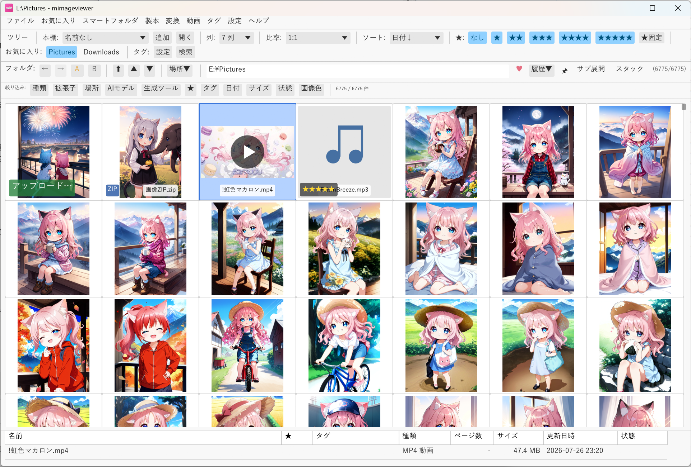
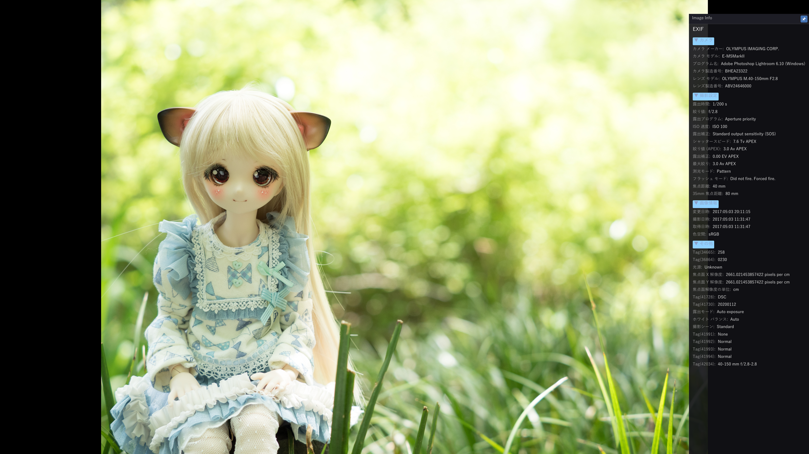
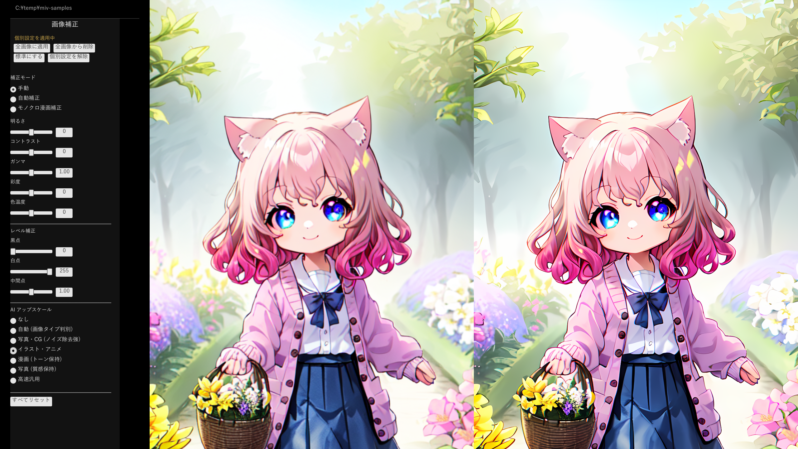
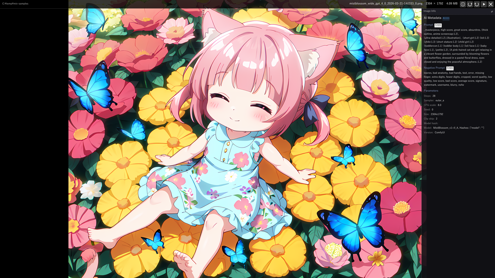

# mImageViewer

**English** | [日本語](#日本語)

A fast, GPU-accelerated **image, comic/manga and video viewer for Windows 11**, written in Rust.
It opens folders as a thumbnail grid, reads images straight out of ZIP and PDF, plays video
inline, and includes GPU AI upscaling.

> **Note:** The application UI is currently available in **Japanese only**.

### Highlights

- GPU-accelerated thumbnail grid with an on-disk cache (instant on re-open)
- Wide format support: JPEG, PNG, GIF, WebP, BMP, HEIC/HEIF, AVIF, JPEG XL, TIFF and camera RAW
- Reads images directly inside **ZIP / CBZ** archives and **PDF** — no extraction.
  Non-solid **RAR / CBR** open directly too; solid / nested / password-protected RAR, plus 7z / CB7 and LZH, are auto-converted to ZIP on click
- **Two-page spread** reading (left-to-right / right-to-left) and continuous vertical /
  horizontal scrolling for manga & comics
- **Inline video playback** (MP4 / MKV / MOV / AVI / WMV / MPEG / HEVC / AV1) via FFmpeg
- **AI 4x upscaling** (Real-ESRGAN / Real-CUGAN / NMKD-Siax), JPEG denoise and an MI-GAN
  inpainting eraser — GPU-accelerated via DirectML / TensorRT
- Reads **AI-generation metadata** (prompts / parameters) from PNG text chunks and JPEG EXIF
- Non-destructive rotation, adjustment presets & local adjustment layers, tagging and search
- **Susie plug-in** support (.spi) for retro PC-98 / X68000 formats (PI / MAG / PIC …)

### Screenshots

| Fullscreen | AI upscaling | AI metadata |
|---|---|---|
|  |  |  |

### Download

Get the latest build from the [**Releases page**](https://github.com/MikageSawatari/mimageviewer/releases/latest) —
installer, single-exe, and portable editions are available (details in the Japanese section below).

Full documentation: [**online manual**](https://mikage.to/mimageviewer/manual/) (Japanese).
Release history: [CHANGELOG.md](CHANGELOG.md) (Japanese).

---

Windows 向け高速サムネイルビューワー

## 概要

mImageViewer は、フォルダを開くだけで中の画像・動画・音声・ZIP・PDF をサムネイルで一覧できる、Windows 用の無料の画像ビューアです（MIT ライセンス、広告なし）。
ZIP / CBZ や PDF はディスクに展開せずにそのままページをめくれ、漫画は見開き・右→左読みで読めます。一度作ったサムネイルはキャッシュに残るので、同じフォルダを開き直したときは待ち時間がありません。
AI アップスケールや消しゴムなどの AI 処理はすべて PC の GPU で実行し、画像を外部へ送りません。

- **ダウンロード**: [Releases ページ](https://github.com/MikageSawatari/mimageviewer/releases/latest)（インストーラ版・単体 exe 版・ポータブル版。違いは下の「ダウンロード」を参照）
- **公式サイト**: [mikage.to/mimageviewer](https://mikage.to/mimageviewer/)　**マニュアル**: [mikage.to/mimageviewer/manual](https://mikage.to/mimageviewer/manual/)
- **よくある質問**: [FAQ](https://mikage.to/mimageviewer/manual/faq.html)

## こんな方におすすめ

- **大量の写真を素早く確認したい** — RAW・HEIC にも対応。フォルダを開くだけでサムネイル一覧
- **AI 生成画像のプロンプトを確認しながら閲覧したい** — PNG や JPEG に埋め込まれた生成メタデータを自動表示
- **ZIP にまとめた漫画や同人誌をそのまま読みたい** — 展開不要で ZIP 内をブラウズ。見開き表示・右→左読み・縦/横連結読みに対応
- **AI アップスケールで綺麗な画像で見たい** — Real-ESRGAN / Real-CUGAN / NMKD-Siax を内蔵。自動選択モードや用途別のモデル切り替えに対応
- **スキャンの汚れを補修したい** — 消しゴム（MI-GAN）と、スポイト色・周囲テクスチャ・クローンを使うマスク付き修復レイヤーに対応。元ファイルは書き換えません
- **PI / MAG / PIC などレトロ画像を閲覧したい** — Susie 画像プラグイン（.spi、32bit）対応。PC-98 / X68000 時代の画像を AI アップスケールと組み合わせて高画質で鑑賞

## 主な機能

- GPU アクセラレーションによるサムネイルグリッド表示
- SQLite + WebP サムネイルキャッシュ（2回目以降は瞬時表示）
- フルスクリーン表示（前後画像の先読み付き）
- 見開き表示（左→右 / 右→左、表紙単独表示対応）と縦/横連結読み表示
- 画像分析モード（カラーピッカー、ヒストグラム、色差強調、グレースケール等）
- AI アップスケール（Real-ESRGAN / Real-CUGAN / NMKD-Siax、DirectML）— 透過 PNG のアルファ保持
- AI JPEG ノイズ除去
- AI 画像修復（消しゴムツール、MI-GAN）— 非破壊マスク保存、タイル処理
- マスク付き修復／塗りレイヤー — 単色・輝度保持着色・周囲からのテクスチャ修復・固定オフセットクローン
- 画像分類（風景・人物・ドキュメント等の自動判定）
- 画像補正（明るさ・コントラスト・色調）＋フォルダ/ZIP/PDF 単位の 4 プリセット
- ポストフィルタ（38 プリセット：CRT / 機種別減色 / カラーグレーディング / フィルム / 絵画風 / シャープ化）
- AI 画像メタデータ表示（PNG テキストチャンク / JPEG EXIF UserComment、主要な生成ツール形式）
- EXIF 表示（日本語タグ名対応）
- 非破壊回転
- レーティング / タグ / 画像補正操作の Undo / Redo（<kbd>Ctrl</kbd>+<kbd>Z</kbd> / <kbd>Ctrl</kbd>+<kbd>Y</kbd>、最大 50 操作）
- ZIP / CBZ 内画像のブラウズ（展開不要、ZIP in ZIP もフラット展開）
- 非ソリッド・入れ子なし・パスワードなしの RAR / CBR はそのまま直接ブラウズ。ソリッド RAR / 7z / CB7 / LZH と、パスワード付き・入れ子ありの RAR はクリックで ZIP 変換して閲覧（変換分は 2 回目以降キャッシュから即座に開ける）
- Susie 画像プラグイン対応（.spi、32bit）— PC-98 / X68000 時代の PI / MAG / PIC / PIC2 / XLD4 等のレトロ画像形式
- PDF 表示（ページごとレンダリング、パスワード付き対応、PDFium 内蔵）
- RAW / HEIC / AVIF / JPEG XL 対応（Windows WIC 経由）
- 動画 インライン再生（MP4 / MKV / MOV / AVI / WMV / MPG / HEVC / AV1 等、FFmpeg LGPL DLL バックエンド）
  - フルスクリーンで Space / Enter 再生、Shift+Enter で外部プレイヤー、シーク / 音量 / ループ操作
  - チャプター / ブックマーク ジャンプ、ピン留めしたフレームをグリッドサムネに固定、タイル モード一覧
- ルーペ機能（Shift 押しっぱなし / M キーでトグル、見開き・消しゴム・分析モードでも併用可）
- UI テーマ（システム / ライト / ダーク）— Windows のアプリ用テーマにリアルタイム追従
- UI フォント選択 — Windows の日本語フォントや追加した TTF / OTF / TTC / OTC の日本語通常書体を画面全体へ適用。実メトリクスによる縦位置自動補正、プレビュー、微調整、記号・絵文字フォールバックに対応
- 本のページブックマーク（B キー）と、動画・音声・本をまとめて見られる「場所▼ → ブックマーク」
- 名前付きコレクション — 実ファイル・フォルダ・ZIP / PDF などへの参照を元ファイル無変更でまとめて保存。ツールバーで追加先を選び、`追加` / `開く` を明示操作。展開時の名前ボタンは左クリックで開き、右クリックで一覧の選択項目を追加。手動順 / 通常ソート、テキスト入出力、PC と mIV Remote の読み取り専用表示に対応
- 透過画像の背景色切替（Shift+B キーで テーマ既定 → 白 → 黒 → 市松 の順に循環）
- お気に入りフォルダ、カスタマイズ可能なツールバー
- メタデータキーワード検索、スライドショー

## ダウンロード

[Releases ページ](https://github.com/MikageSawatari/mimageviewer/releases/latest) から以下のいずれかをダウンロードできます。

- **インストーラ版** (`mImageViewer_setup.exe`) — setup.exe を実行してインストール。スタートメニュー登録・アンインストール機能付き（インストール時に管理者権限 / UAC が必要）。設定は `%APPDATA%\mimageviewer\` に保存されます
- **単体 exe 版** (`mimageviewer.exe`) — 任意のフォルダに置いて実行するだけ。管理者権限不要。設定は `%APPDATA%\mimageviewer\` に保存されます
- **ポータブル版** (`mImageViewer_portable_v<VERSION>.zip`) — zip を書き込み可能な場所（デスクトップ・D ドライブ・USB 等）に解凍して実行するだけ。管理者権限不要。設定・キャッシュは exe と同じフォルダの `data\` にまとまり、システムドライブの APPDATA を使いません。フォルダごとコピーで持ち運び・完全削除ができます（`C:\Program Files\` など書き込みできない場所に置くと起動できません）

## 動作環境

- Windows 11（64bit）
- DirectX 12 対応 GPU
- メモリ 4GB 以上推奨

## 対応フォーマット

| 種類 | フォーマット |
|------|-----------|
| 静止画（内蔵） | JPEG, PNG, GIF, WebP, BMP |
| 静止画（WIC） | HEIC, AVIF, JPEG XL, TIFF, 各社 RAW |
| 静止画（Susie 経由） | PI, MAG, PIC, PIC2, XLD4 などレトロ形式（.spi プラグインを導入した場合） |
| アニメーション | GIF, APNG, Animated WebP |
| ドキュメント | PDF |
| アーカイブ | ZIP / CBZ と 非ソリッドの RAR / CBR（展開不要でブラウズ）、ソリッド RAR / 7z / CB7 / LZH（クリックで ZIP に自動変換） |
| 動画（インライン再生） | MP4, MKV, MOV, AVI, WMV, MPG, MPEG, HEVC, AV1 ほか FFmpeg avformat 対応形式 |

## マニュアル

[オンラインマニュアル](https://mikage.to/mimageviewer/manual/) — インストール方法・操作方法・キーボードショートカット・設定リファレンス

## 技術情報

- **言語**: Rust (edition 2024)
- **GUI**: eframe / egui (wgpu バックエンド)
- **JPEG 高速デコード**: TurboJPEG (libjpeg-turbo, SIMD スタティックリンク)
- **PDF エンジン**: PDFium（exe に埋め込み、並列レンダリング。同時処理数は環境設定で 3〜10、既定 5。うち 1 つを優先操作用に予約）
- **サムネイルキャッシュ**: SQLite + WebP

## 更新履歴

版ごとの変更点は [CHANGELOG.md](CHANGELOG.md) にあります。
[オンラインマニュアルの更新履歴](https://mikage.to/mimageviewer/manual/changelog.html)でも同じ内容を読めます。

## ライセンス・作者

[MIT License](LICENSE) — 無料でご利用いただけます。詳細は LICENSE ファイルを参照してください。

**Copyright © 2026 SANO Taku (佐野 拓).** mImageViewer is developed and maintained by
SANO Taku (online handle "Mikage Sawatari"), GitHub [@MikageSawatari](https://github.com/MikageSawatari).

eframe / egui は Emil Ernerfeldt および contributors により
`MIT OR Apache-2.0` で提供されています。ライセンス全文は
[MIT](vendor/egui-wgpu/LICENSE-MIT) / [Apache-2.0](vendor/egui-wgpu/LICENSE-APACHE) を参照してください。

RAR 展開には RARLAB UnRAR source code を利用します。UnRAR のライセンス全文は [UNRAR-LICENSE.txt](UNRAR-LICENSE.txt) を参照してください。
